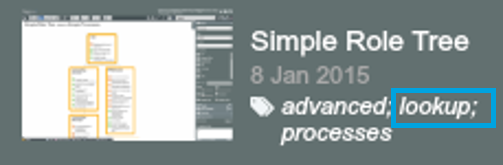

# Create a lookup table

There are two ways to create a lookup table:

1. ‘Lookups’ tab: OrgVue provides one tab to store common Lookups 

2. ‘Lookup’ tag: you can make any dataset in any tab into lookup table by tagging it as `lookup`

