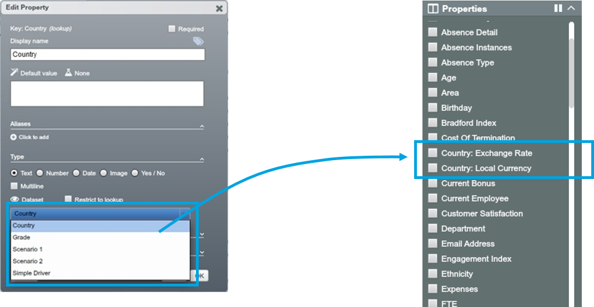
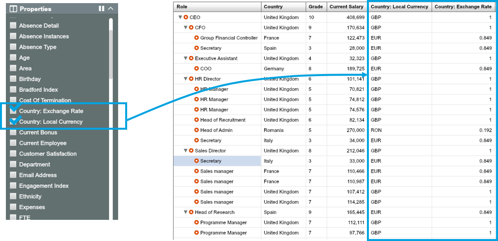

# Exercise: Payment Review

**Situation**

* An organisation employs people across several European countries
* Current payroll records show what employees are paid in their local currencies

**Complication**

* The company wants to move activity to the best locations in terms of cost
* To focus the discussion, it wants to estimate the overall salary benefit and the benefit per department and per role from a move

**Tasks**

Identify the gap between actual and target salaries per department:

* Convert current local salary to GBP by looking up exchange rate (Lookups)
* Look up target salary for each grade (Lookups)
* Calculate the gap between current salary and target salary (Expressions)
* Visualise the salary difference (Chart, Color by)

**Note:** Datasets to use: 8.1 Payment review, 8.2 Country (lookup), 8.3 Grade (lookup)

##How-to summary

1. **Get actual salary in GBP**
  2.  **Look up** exchange rate for each country from Country dataset  
  3.  Create a property for salary in GBP using ** *Expressions* ** 
  
2. **Get target salary by grade**
  3. **Look up** target salary for each employee based on grade
  
3. **Capture the difference**
  4. Create a property fill in the gap between actual and target salary using **Expressions**

4. **Visualise the gaps**

5. See the gap between the two in the Tree using **Color by**

6. See the gap by department / depth using **Chart**
  
##Get exercise data into OrgVue 

1. Open the Excel workbook for OrgVue Advaned Training
2. Find 3 sheets for this chapter:

  * 8.1 Payment review,
  * 8.2 Country (lookup)
  * 8.3 Grade (lookup)

3. OrgVue, create a dataset named ‘Payment Review – [your name]’ in the People tab using ‘8.1 Payment review’ data sheet; this dataset will be the main dataset

4. Navigate to the Lookups tab, create 2 lookup datasets using ‘8.2 Country (lookup)’ and ‘8.3 Grade (lookup)’

##Get actual salary in GBP

###Look up local currency and exchange rate

1. Go to the main dataset ‘Payment Review’, open up the Edit Property dialogue for the Country property

2. Set ‘Dataset’ lookup mode and choose ‘Country’ dataset; this allows the properties in the Country lookup dataset to be imported to the main dataset

3. Notice the two properties in the Country (lookup) dataset are brought into the main dataset

4. To see Local currency and Exchange rate from the lookup dataset in the Worksheet, simply check them from the Property list

###Convert salary in local currency into GBP

1. Create a new property named ‘Salary GBP’ using the below Expression to calculate converted: `salarynode.math("currentsalary*country.exchangerate")`

2. Now new ‘Salary GBP’ property is added and populated with values

###Look up target salary 

1. Open up the Edit Property dialogue for the ‘Grade’ property

2. Set ‘Dataset’ lookup mode and choose ‘Grade’ dataset; this allows the properties in the Grade lookup dataset to be imported to the main dataset

3. Notice the two properties in the Grade (lookup) dataset are brought into the main dataset

##Calculate the difference between actual and target salary

1. Add a property named ‘Salary Gap’ using the below Expression to automatically fill in the difference between actual and target salary: `node.math("salarygbp-grade.targetsalarygbp"`

 
2. Notice that new ‘Salary Gap’ property is added and populated with values

##Visualise the gaps 

###Total salary gap for whole organisation

Go to Chart view and create a bar chart showing total salary gap.  

###Salary gap aggregated by area and department

Chart the salary gap by area and department respectively.

###Average salary gap per role

Chart the average salary gap per role.

###Salary gap by individual role

Now let’s display the gaps within org tree. Navigate to Tree view, create an org chart colored by Salary Gap.

