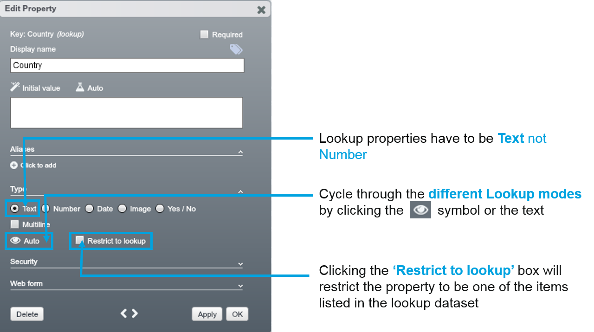
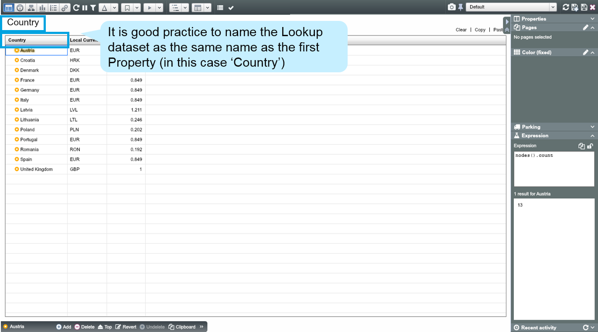
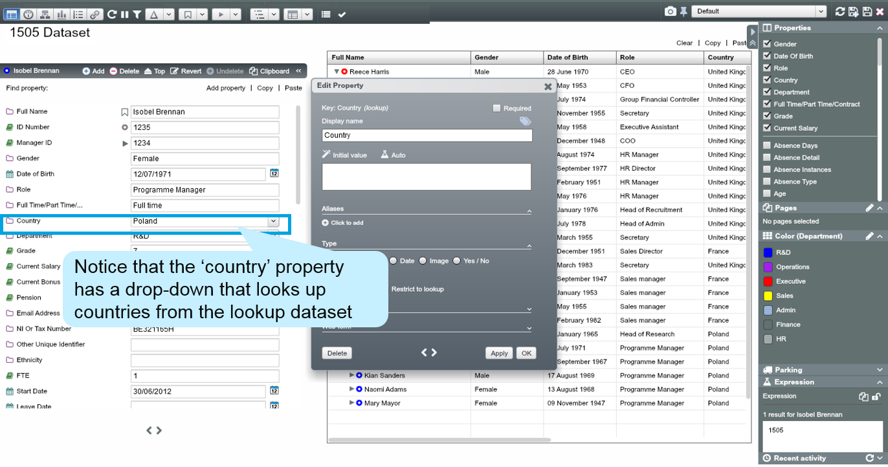
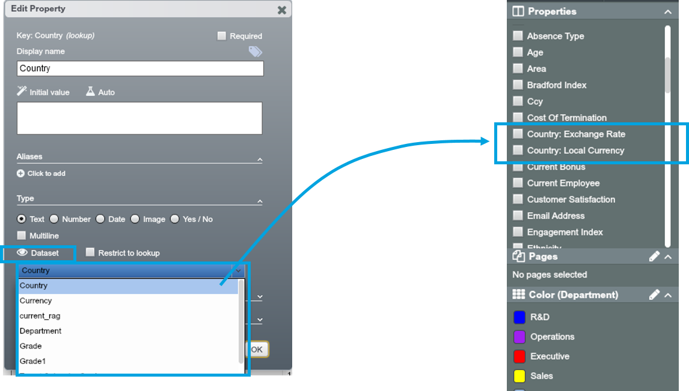
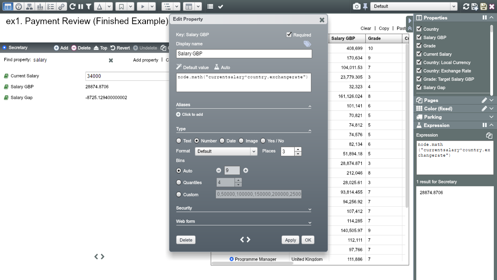
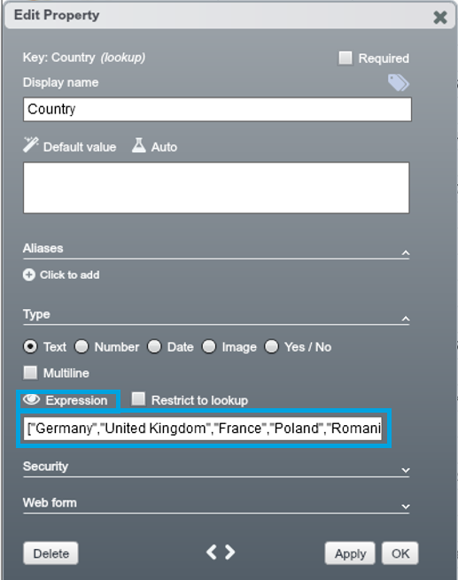
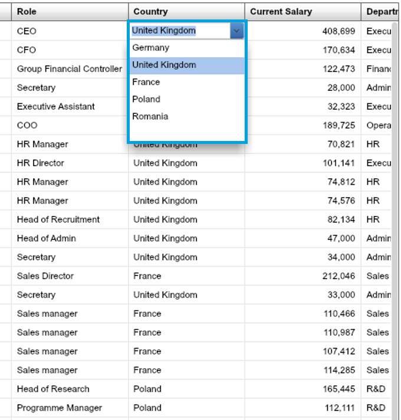
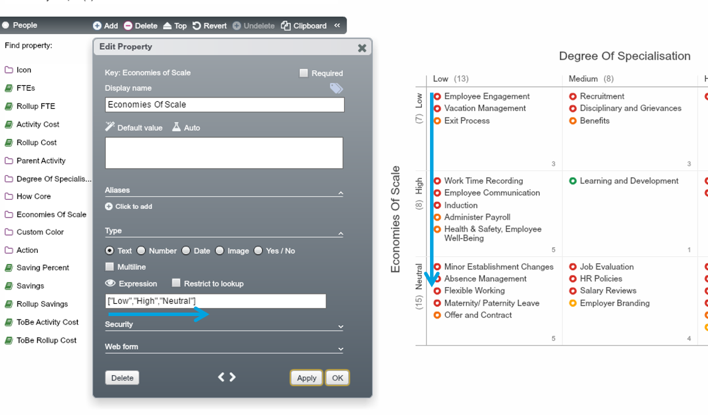

# Set up lookups

##Control options

You can set up lookups through the Property dialogue.

##Lookup modes

OrgVue’s four lookup modes provides control and flexibility in using lookups.

| Lookup mode | Functions of the mode|
| -- | -- |
| Auto  | For datasets in the Lookup tab (or those tagged as `lookup`) which share the same name as the key of the property, a lookup function will  be performed. However, no other properties from the lookup dataset are imported. |
| None| No lookup will be performed regardless of their being a dataset of the same name in the Lookup tab.|
| Dataset | This mode allows you to select any dataset from either the Lookup tab or those tagged as `lookup` the dataset does not need to have the same name as the property key but the lookup will always be performed on the id field of the lookup dataset. The properties of the lookup dataset will also be imported and are available for use in charts, dashboards, pivot view and elsewhere. The imported properties can also be accessed via expressions. |
| Expression | This is where a lookup list is defined using a manual expression.|

###Auto mode

To use Auto mode, name the Lookup dataset as the same name as the property which will reference Lookup table in the main dataset.

In Auto mode, the ‘Country’ Property is referencing the ‘Country’ Lookup dataset purely through the fact that it shares the same name.

##Dataset mode

1. Selecting Dataset mode will open a drop-down of all the lookup datasets in the tenant allowing you to import other properties
2. The properties in the selected lookup dataset have been imported and available to use in the main dataset (which can be used in expressions or charts and pivot view)

Once a lookup has been defined, any property in the lookup dataset is available to use in an expression. in this example, a new property ‘Salary GBP’ have been created using the lookup property: 

`node.math("currentsalary*country.exchangerate").`

##Expression mode

Expression mode is useful to create a lookup list on a manually entered options for the drop-down. 
Make sure the syntax is correct. Enclose each item for the drop-down in quotation marks, separate each with a comma, and surround the whole expression in square brackets:

`[“item1”,“item2”, … ,“itemX”]`

The text labels on Pivot, Dashboard, Chart and etc. appear in the alphabetical order by default, e.g. High, Low, Neutral. The Expression mode helps you customise the order of the labels displayed as the labels will be sorted in the same order as defined in the square bracket, e.g. Low, High, Neutral. 

