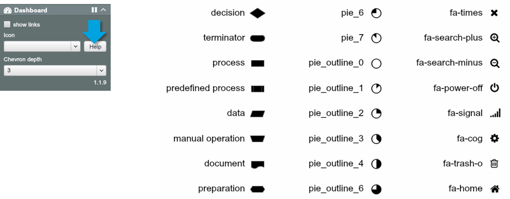
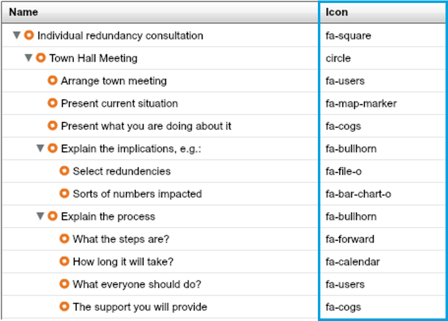

# Add icons to Process Dashboard

##Process icons

###View available icons

In the Processes dashboard control panel you can click on the 'Help' icon to display a comprehensive list of available buttons.

###Assign icons

Create a property in the dataset to store an icon for each node and populate it with appropriate icon names.

###Display icons
 a

