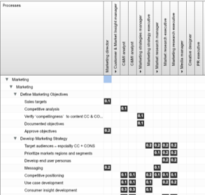
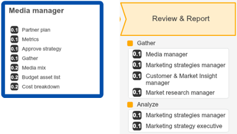
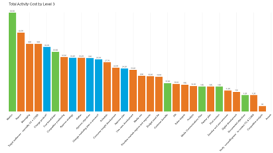
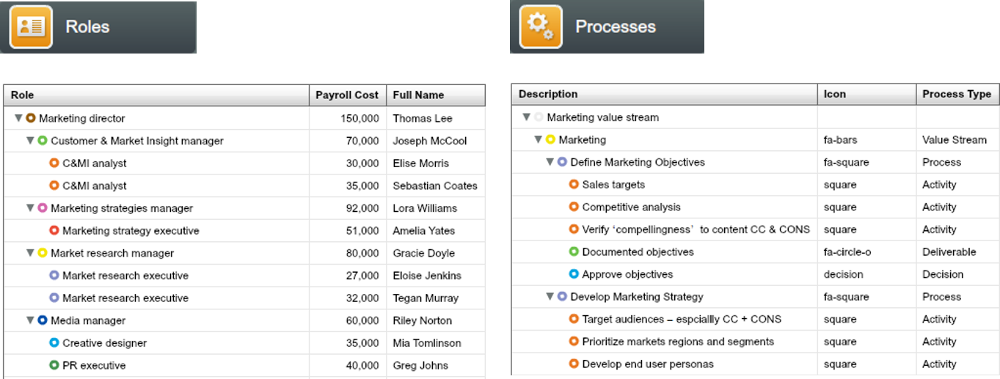
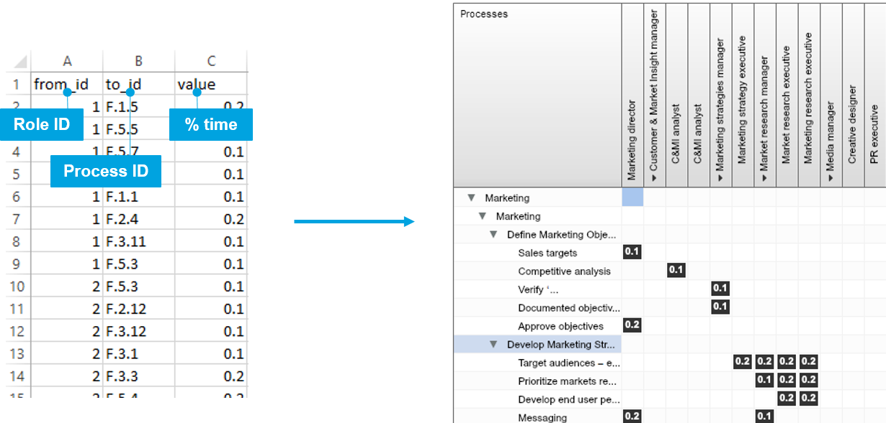
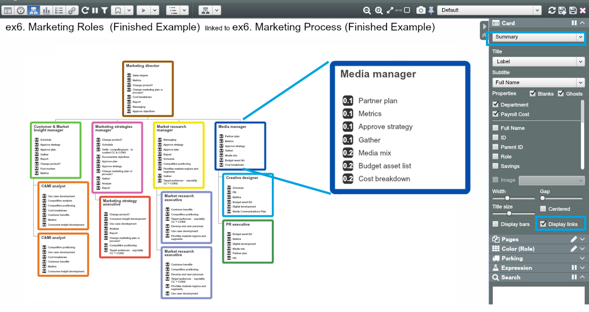
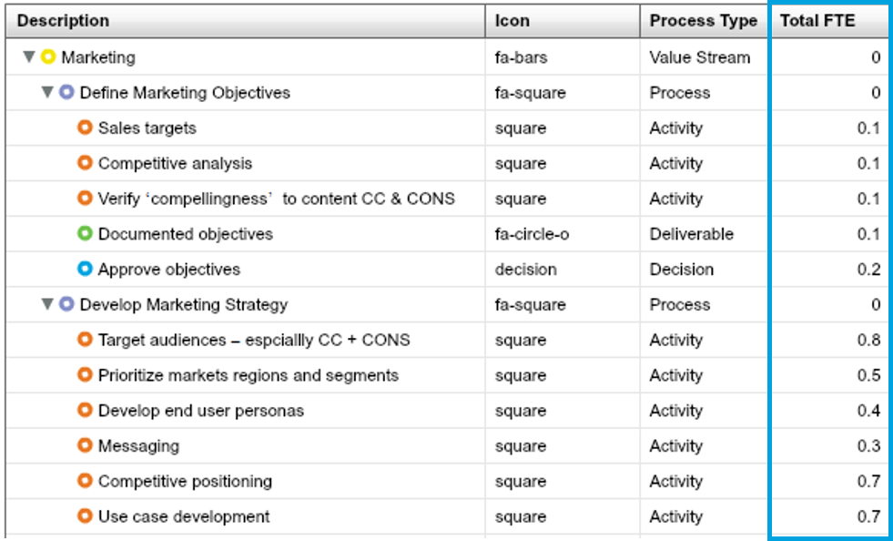
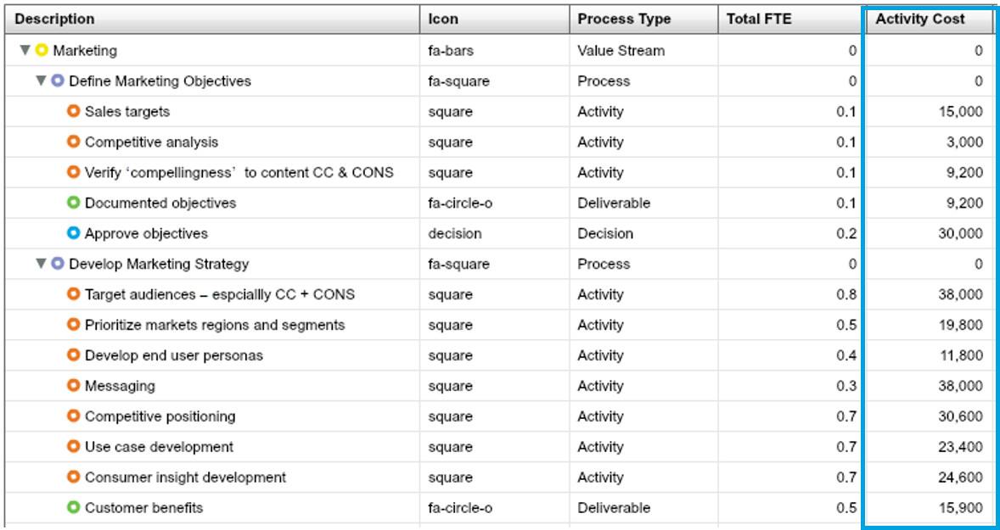
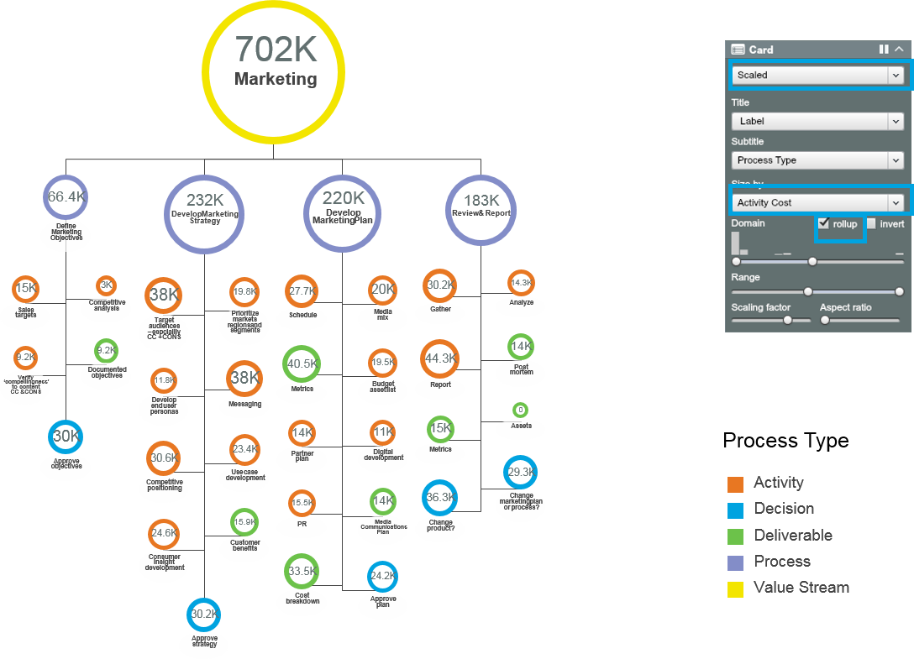
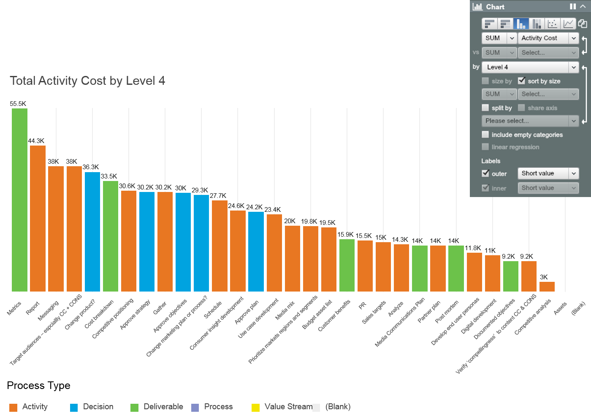

# Exercise: Activity Analysis

###Set up Datasets and Links



1. Set up a Roles dataset and a Process dataset 
2. **Link** Roles dataset to Process dataset through % time spend (activity data)

###Show what people can do


1. See how people’s time is allocated between activities in **Org chart**
2. See how the work is done from **Process dashboard**

###Calculate and analyse Activity Cost


1. Calculate **cost of each activity** based on actual FTEs involved and payroll cost
2. See which activities use most resources using **Chart**
3. See activity cost in activity tree **roll-up Scaled card**

##Set up Roles and Processes datasets

Prepare the roles and the process datasets in OrgVue using the given Excel data sheets:

1. In the Roles tab, create a new dataset using the ‘12.1 Marketing Roles’ sheet. It contains role titles, cost, department and etc.
2. In the Processes tab, create a new dataset using the ‘12.2 Marketing Processes’ sheet. It contains activity data in a hierarchy



##Link Roles dataset to Processes dataset through time spend

After setting up Roles and Processes datasets, create link values using the ‘12.3 Links’ sheet. 

1. Open up the Roles dataset ‘Marketing Roles’ you have saved in the Roles tab
2. Navigate to the Link view and click on            
3. Choose your Marketing Process dataset from the dropdown list
4. Copy the id to id link values from the ‘12.3 Links’ sheet and paste them into the matrix – click on ‘Paste’ at top right then press Ctrl-V



**Note:** In practice, IAA Survey can be used to crowdsource activity data (% time spent on each activity) and populate links automatically. 

##View Org Chart including activities

See what each role does and how much time that they spend doing it:

1. Switch to Tree view within the Roles dataset and configure Summary card
2. Check ‘Display links’ to view linked activities with time spend



##View actual FTEs on Process dashboard

To view process breakdowns with linked roles and % time spent:

1. Open the Processes dataset linked from the Roles dataset
2. Navigate to Dashboard view and choose Processes dashboard
3. Set Chevron depth as 2
4. Check ‘show links’ to display linked roles with % time spent

 
##Calculate total time spent on each activity

  In the Process dataset create a new property ‘Total FTE’ to calculate actual FTEs linked to each activity using the syntax: ```node.links.value.sum``` 
  – this will calculate total number of FTEs working on each activity based on the link values (% time spent).
  
  
  
##Calculate activity cost 

Converting time to cost can deliver insights on aggregated activity costs. Within the Processes dataset create a new property **‘Activity Cost’** and populate it with calculated value based on linked FTE values and the associated payroll cost using the syntax:
```node.links.math("value*to.payrollcost").sum```
– this will calculate cost of activity based on the linked % time and the associated payroll cost from Roles datasets.



##View Activity Cost

###Activity Tree

To view total activity cost and breakdowns in an activity hierarchy:

1. Navigate to Tree View
2. On the Card Panel choose Scaled card and sized by Activity Cost
3. Check ‘rollup’ to see the cost as rollup



###Bar Chart




