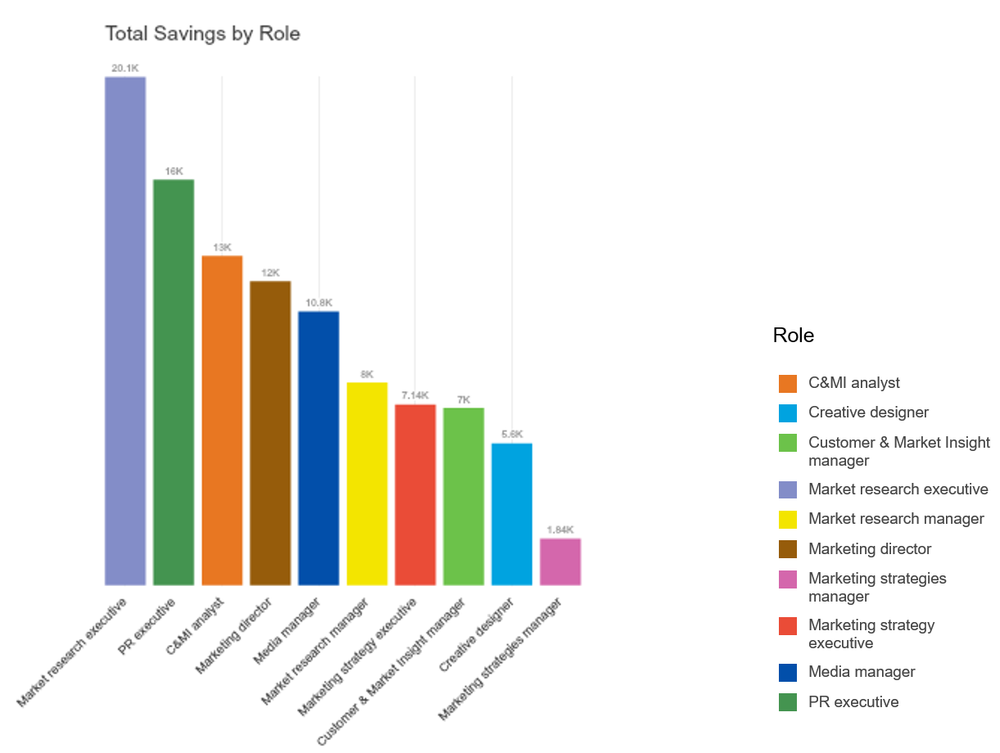

# Exercise: Process re-design
###Perform Dimensional Analysis


1. Choose 2 dimensions based on design criteria
2. Set up properties for 2 chosen dimensions using **Lookup**
3. Use **Pivot** and **Paging** place each activity against dimensions
4. Identify the areas to improve

###Determine Actions based on Analysis


1. Identify possible actions for increasing efficiency and attached estimated saving effects
2. Save Action list as a **Lookup** dataset
3. Determine suitable actions for each activity based on dimensional analysis and review of other aspects including process type, frequency, number of roles involved, cost and etc.

###Measure and Visualise the Impacts


1. Calculate expected savings after taking actions
2. Using **Scaled org chart**, compare cost before and after taking actions
3. **Chart** the impacts of changes, e.g. FTEs affected by outsource, cost saving per level 2 process/ per role and etc.

##Perform Dimensional Analysis and Segmentation 

###Choose Dimensions

Having performed IAA you will have a huge amount of information. To help organise and analyse it in a way which provides useful outputs to feed into design improvements and decisions it is useful to segment similar activities into categories. These categories can be defined by creating a set of activity dimensionsbased on your design criteria and key questions. To do this with OrgVue:

1. Choose 2 dimensions, for this exercise ‘SOT (Strategic, Operational, Transactional)’ and ‘How Core (Core, Semi-Core, Non-Core)’
2. Add 2 new properties for each dimension using Lookup Expression mode
  3. Add new property named ‘SOT’ and set Lookup:
  
  4. Add new property named ‘How Core’ and set Lookup:
  


This will allow you to set value from the dropdown list


**Note:** Depending on your design criteria they may demand different dimensional analysis. For example: Reason for the work, Nature of the work, Fixed or variable, Economies of scale, Customer facing, Time horizon, Geographical, Current or New.

###Plot the Work against Dimensions

The Pivot view offers convenient interface for dimensional analysis. 

1. Navigate to Pivot View
2. Set Columns as SOT and Rows as How Core, and move Cell width and Max/ cell slider to make all nodes (activities) are nicely displayed on the Canvas for you
3. All nodes are placed within the ‘(Blank) x (Blank)’ cell as the values for those 2 properties are empty. Now we will look at each of the activity and assign values 
  * **Note**: This analysis should be done at the lowest level of process which is Level 3 for this example. Use Filter Control to only display level 3 activities. 

4. To make the process manageable, page the Pivot table by Level 2 process

  
5. Using the arrows page it to ‘Define Marketing Objectives’ then only 5 activities will be shown 
  
6. To assign new value for ‘Sales target’, drag and drop the node on to the Column title ‘SOT’

7. Then you are prompted to set the value from the dropdown list, i.e. Strategic, Operational, Transactional. 

8. ‘Strategic’ has been chosen for ‘Sales targets’. 

9. Using the same method, all 5 activities have been placed against How Core and SOT

10. Now go to next page and assign values
11. After completing it page by page, come back to ‘(All)’ and see all nodes on the same page. You will see all activities have been placed against dimensions
12. Make tweaks if needed
13. You can add other aspects to the analysis such as Total FTE, Activity Cost or process type using colouring

**Note:** Assigning values using Pivot view will populate values for SOT and How Core properties – go to Worksheet view and check.

###Identify the areas need improvements

Dimensional analysis helps you to identify the areas which require actions to improve efficiency. For example:

* Non-Core activities  consider to stop the work
* Semi-Core Operational activities with higher FTEs involved  need productivity improvement
* Transactional activities with high FTEs involved  consider to outsource 


###Identify actions and saving effect

1. Based on the design criteria (say cost saving), list possible actions to be taken and estimated savings effect, e.g. Outsourced activities will only cost 60% of the original cost

  
2. Save it as lookup table in OrgVue

3. Within the Processes dataset add a new property ‘Action’. Set value mode as ‘Initial’ and type in ‘Nothing’ in the value box to populate all cells with ‘Nothing’ as an initial value
 
 
4. Set Lookup mode as ‘Dataset’ and choose the dataset you havejust created for actions

###Assign actions to each activity

Now assign appropriate actions to the activities identified to need actions.

1. Drag a group of nodes to assign same action and drop into Parking Lot
2. Open up Filter Control and make ‘Action’ filter active. Drag the nodes from the Parking Lot and drop onto the Action filter to set a value from the lookup. 


##Measure the impact of actions

###Calculate savings per activity 

Having assigned actions, create 3 new properties to measure impact of actions:

1. Add a new property called ‘New Activity Cost’ using the syntax:
```node.activitycost*node.action.savingeffect``` – it calculates new activity cost with savings effect applied```
2. Add a new property called ‘Savings’ using the syntax: ```node.activitycost*(1-node.action.savingeffect)``` – it calculate expected savings, i.e. the gap between the current and new activity cost
3. Add a new property called ‘Rollup Savings’ using the syntax: ```node.rollup('savings','sum')```- it calculates rollup savings


##Visualise the impact of actions

###FTEs affected by each action


###Amount of savings achieved by each action


##Measure the impact of actions

###Savings aggregated per role

Now open up the Roles dataset and aggregate impacts by role. Create a new property called ‘Savings’ using the syntax:

```node.links.math('value*from.payrollcost*(1-to.action.savingeffect)').sum``` – it calculates total savings linked to each role


##Visualise the impact of actions

###Savings aggregrated per role

####Column Chart



####Scaled Org Chart


