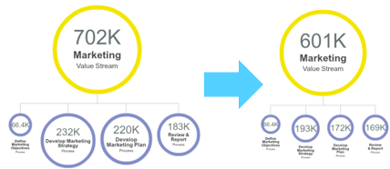

# Exercise: Process re-design
###Perform Dimensional Analysis

1. Choose 2 dimensions based on design criteria
2. Set up properties for 2 chosen dimensions using **Lookup**
3. Use **Pivot** and **Paging** place each activity against dimensions
4. Identify the areas to improve

###Determine Actions based on Analysis

1. Identify possible actions for increasing efficiency and attached estimated saving effects
2. Save Action list as a **Lookup** dataset
3. Determine suitable actions for each activity based on dimensional analysis and review of other aspects including process type, frequency, number of roles involved, cost and etc.

###Measure and Visualise the Impacts

1. Calculate expected savings after taking actions
2. Using **Scaled org chart**, compare cost before and after taking actions
3. **Chart** the impacts of changes, e.g. FTEs affected by outsource, cost saving per level 2 process/ per role and etc.

##Perform Dimensional Analysis and Segmentation 

###Choose Dimensions

Having performed IAA you will have a huge amount of information. To help organise and analyse it in a way which provides useful outputs to feed into design improvements and decisions it is useful to segment similar activities into categories. These categories can be defined by creating a set of activity dimensionsbased on your design criteria and key questions. To do this with OrgVue:

1. Choose 2 dimensions, for this exercise ‘SOT (Strategic, Operational, Transactional)’ and ‘How Core (Core, Semi-Core, Non-Core)’
2. Add 2 new properties for each dimension using Lookup Expression mode
  3. Add new property named ‘SOT’ and set Lookup:
  
  4. Add new property named ‘How Core’ and set Lookup:
  

This will allow you to set value from the dropdown list

**Note:** Depending on your design criteria they may demand different dimensional analysis. For example: Reason for the work, Nature of the work, Fixed or variable, Economies of scale, Customer facing, Time horizon, Geographical, Current or New.

###Plot the Work against Dimensions

The Pivot view offers convenient interface for dimensional analysis. 

1. Navigate to Pivot View
2. Set Columns as SOT and Rows as How Core, and move Cell width and Max/ cell slider to make all nodes (activities) are nicely displayed on the Canvas for you
3. All nodes are placed within the ‘(Blank) x (Blank)’ cell as the values for those 2 properties are empty. Now we will look at each of the activity and assign values 
  * **Note**: This analysis should be done at the lowest level of process which is Level 3 for this example. Use Filter Control to only display level 3 activities. 

4. To make the process manageable, page the Pivot table by Level 2 process
    

5. Using the arrows page it to ‘Define Marketing Objectives’ then only 5 activities will be shown 
6. To assign new value for ‘Sales target’, drag and drop the node on to the Column title ‘SOT’
7. Then you are prompted to set the value from the dropdown list, i.e. Strategic, Operational, Transactional. 
8. ‘Strategic’ has been chosen for ‘Sales targets’. 
9. Using the same method, all 5 activities have been placed against How Core and SOT
10. Now go to next page and assign values

**Note**: This analysis should be done at the lowest level of process which is Level 3 for this example. Use Filter Control to only display level 3 activities. 

  

