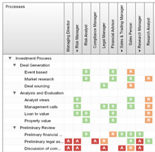
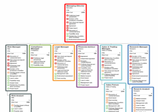
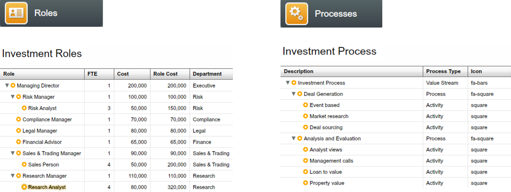
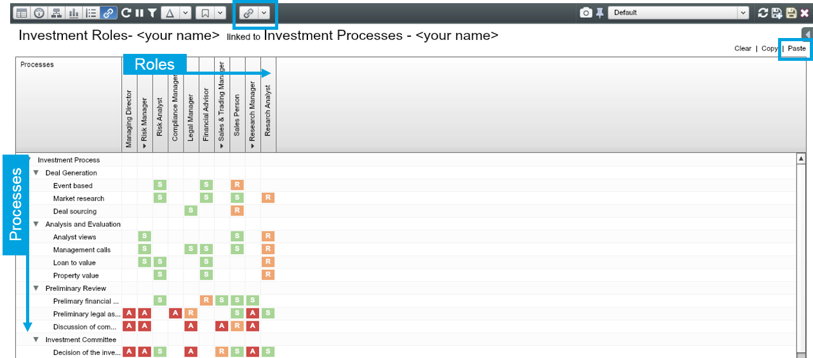
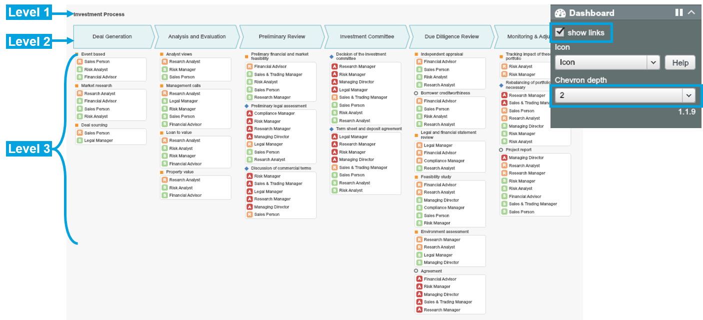
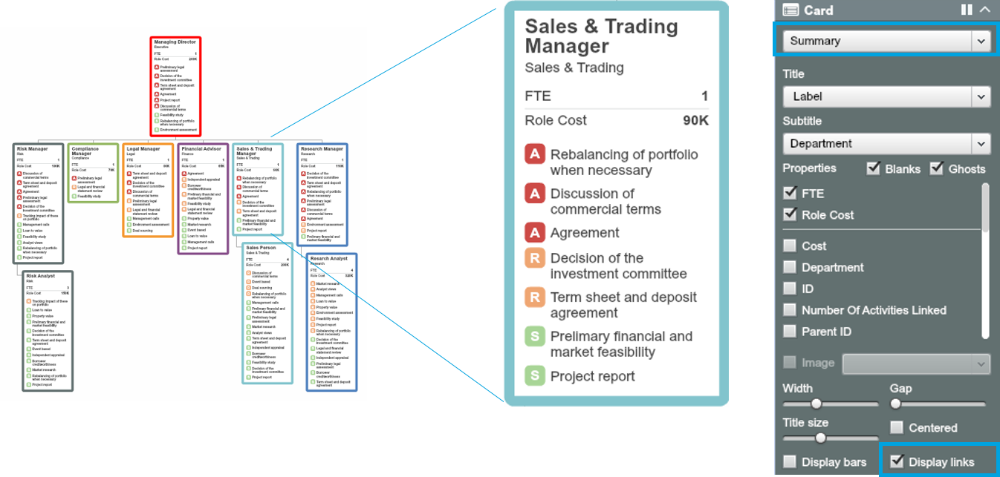
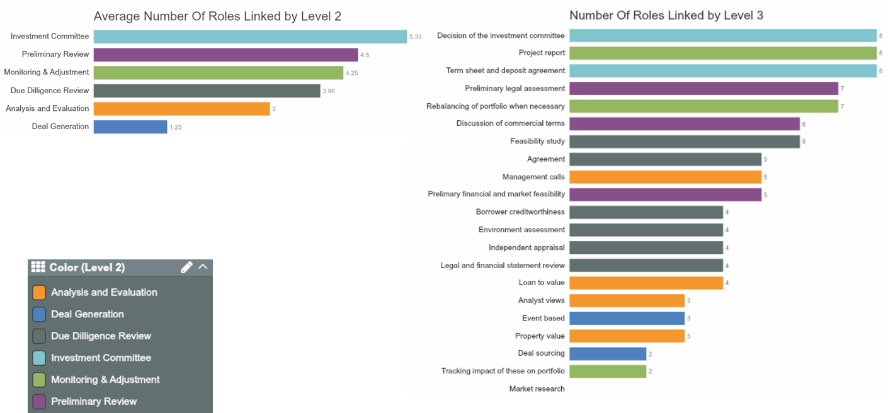
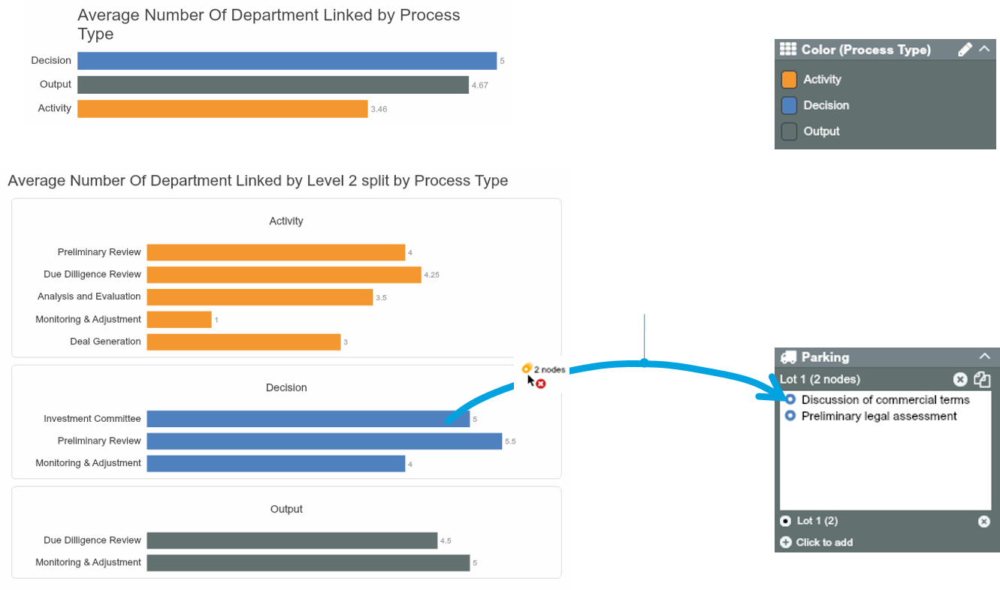
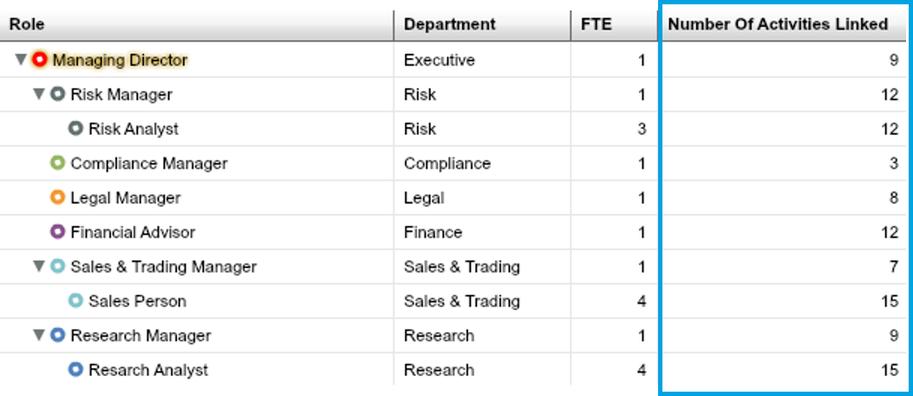
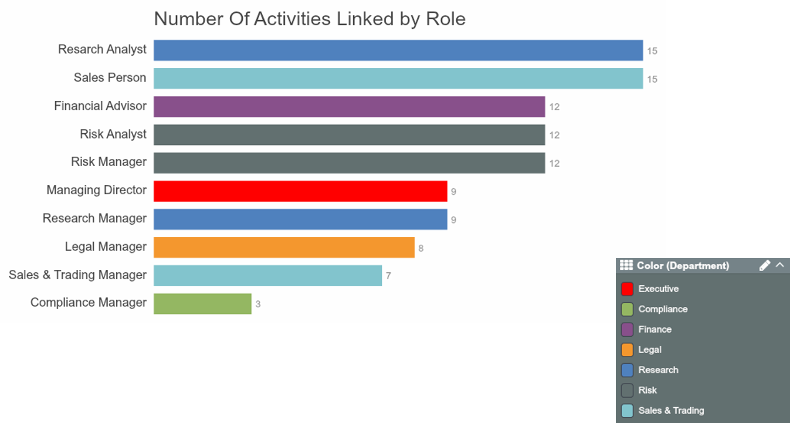

# Exercise: RAS mapping

##Situation

* An international bank is losing market share due to slow investment decisions
* Too many people are involved in signing off actions. It wants to simplify accountability and reduce cost and time to act

##Complication

* Regulatory pressure requires the bank to prove its compliance with anti-money laundering and multiple other regulations
* The bank’s board requires any changes to reduce workload but still be compliant

##Tasks
Review current responsibilities linked from Roles to Processes :
* Show any activities over-loaded with decision makers and approvers
* Show any processes not covered properly
* Show where >3 departments are involved in approving
* Identify opportunities to reduce numbers of decision makers

**Note:** Datasets to use: 11.1 Investment Roles, 11.2 Investment Processes, 11.3 Links

##How-to summary

###Set up Roles and Processes Datasets


1. Create a dataset in **Role**s tab based on the roles hierarchy
2. Create a dataset in **Processes** tab based on the defined processes

###Create Link Values (RAS Mapping)



1. Open up the Role dataset and **Link** it to the Processes dataset
2. In the linking matrix, map R, A, S against each activity

###Review current accountablities



1. Find out any activities not covered properly using **Processes dashboard**
2. Find out any activities over-loaded using **Summary Card**
3. Quantify number of people involved in each activity using **Linked expression and Chart**

##Set up Roles and Processes datasets

Create the roles and the process datasets to be linked in OrgVue using the given Excel data sheets:

1. In the Roles tab, create a new dataset using the ‘11.1 Investment Roles’ sheet. It contains role titles, cost, department and etc.
2. In the Processes tab, create a new dataset using the ‘11.2 Investment Processes’ sheet. It contains activity data in a hierarchy



##Link the Roles dataset to the Processes dataset through RAS


Create links using the ‘11.3 Links’ data sheet. 

1. Open up the ‘Investment Roles’ you saved in the Roles tab
2. Navigate to the Link view and click on            
3. Choose your ‘Investment Processes’ dataset from the dropdown list
4. Copy all data in the ‘11.3 Links’ sheet and paste them into the matrix – click on ‘Paste’ at top right then press Ctrl-V
5. RAS values are now mapped against each activity (process) as shown below



##Review current accountabilities

###Process view

Processes Dashboard helps you instantly see activities over-loaded with approvers or not covered properly. To view Process dashboard with RAS:

1. Within the Processes dataset navigate to Dashboard View and choose ‘Processes’
2. On the Dashboard Control, set Chevron depth as 2
3. Check the ‘show links’ to display linked roles and their accountabilities (RAS)



###Role view

You can view which activities each role is involved in and the type of involvement (RAS) in the context of organisational hierarchy:

1. Within the Roles dataset navigate to Tree View 
2. On the Card Panel, choose Summary card and the properties to display
3. Check the ‘Display links’ to display linked activities



##Quantify the numbers involved in each activity 

Within the Processes dataset set up 2 new numerical properties to quantify linked roles and department per activity.

1. Add a new property called ‘Number Of Roles Linked’ using the syntax: `node.links.to.role.count` – it counts the number of roles involved in each activity
2. Add a new property called ‘Number Of Department Linked’ using the syntax: `node.links.to.department.distinct.count` – it counts the number of departments involved in each activity

##Identify the issues in accountability using charts

Charting number of linked roles per activity helps quickly identify activities not covered or overwhelmed by decision makers.



Visualising the number of linked departments helps identify activities that are likely to be unduly slow.



**Interactive Chart:** click on any bar and drag-and-drop it to the Parking lot to see the nodes (level 3 activities) 

##Quantify the number of activities each role involved

Within the Roles dataset, set up new numerical property to quantify number of activities associated with each role. Add a new property called ‘Number Of Activities Linked’ using the syntax: ```node.links.count``` – it counts the number of linked activities for each of the roles.



**To count number of linked activities through R and A:**

It can be useful to know the number of activities each role is Responsible for or required to Approve. The following expression will count the number of A or R links to an activity: 
```node.links.filter(n=>n.value=="R"||n.value=="A").count```

##Identify the issues in accountability using charts

Visualising number of linked activities by role help us to identify the roles involved in too many activities.




