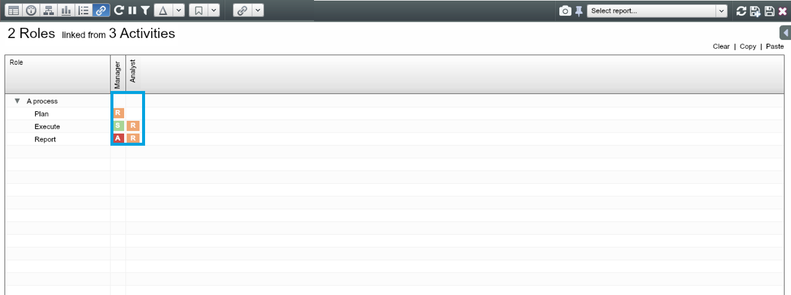

# Links

##Introduction

One dataset can be linked to another in a different tab through numbers (e.g. % time spent) or text (e.g. RAS). FROM and TO correspond to the datasets being Linked together – the order is shown on the Home Screen, e.g. From People To Roles, From Roles To Processes, From Roles To Objectives and etc.

##Choose datasets to link

1. Open up a dataset you want to link from, in this example ‘2 Roles’ from the Roles tab
2. Navigate to Link view and click on          From the drop-down list choose a dataset to link to – e.g. ‘3 Activities’ in the Processes tab
3. From the drop-down list choose a dataset to link to – e.g. ‘3 Activities’ in the Processes tab

4. When two datasets are prepared for linking, the Labels of both datasets appear in the matrix – here Roles across the columns and Processes across the rows

##Create links

###Method overview

You can create link values using one of the 3 methods or combining 2 or 3 methods.

###Method 1. Direct Input

Type in values or click through in each cell in the matrix.

**Note:** Remember you can always return to the Link View at any time and alter the Linking Matrix to update your data.

###Method 2. Drag-and-Drop in Filter Control

You can also define your Links between two Linked Datasets using drag and drop in the Filter Control. When a dataset is linked to another dataset, all properties from both datasets are available to select as filters.

1. Open up the Filter Control and select the Label of both the Roles and the Processes dataset. You can check other properties containing useful information in defining links, e.g. department, role cluster
2. Left click on a node in the Roles dataset (e.g. Analyst) and hold down to drag onto a particular activity
3. In the ‘Create Links’ dialog box, confirm the new Link mapping and the value that the Link should take (e.g. R)

**Note:** You can also link multiple nodes at once by selecting desired group or multiple individual nodes.

###Method 3. Copying values from Excel

If you have a set of link values in Excel you can copy and paste these into the OrgVue linking matrix.

1. Using these exact headers – ‘from_id’, ‘to_id’ and ‘value’, define the link value between each role and process
2. Click on ‘Paste’ at top right corner and press CTRL-V to paste values into the matrix

##Visualise links (accountabilities)

The linked values can be shown from both position and process point of views.

###Position View (Role Tree)

* Org chart displaying the linked activities
* Everyone in the organisation can see what they are accountable for

###Processes View (Processes Dashboard)

* Process map showing the roles involved in each activity 
* Employees can see how they should interface with others for a given activity 

