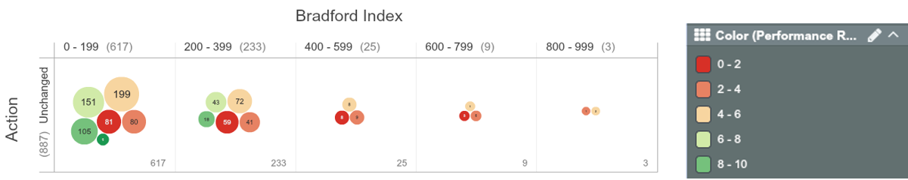
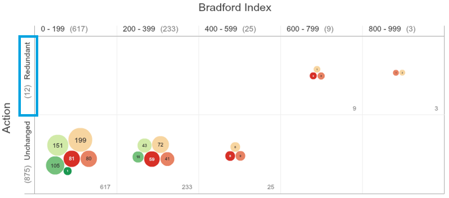
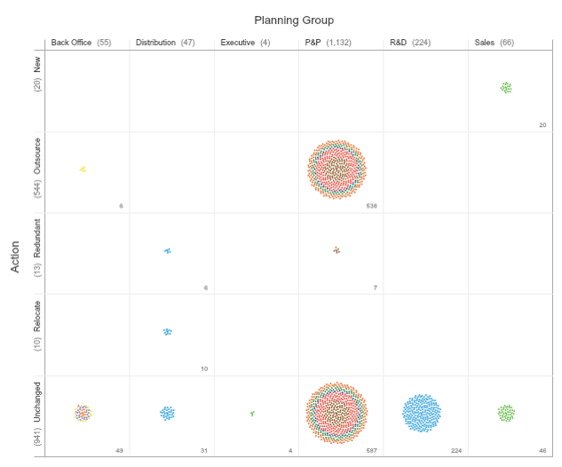
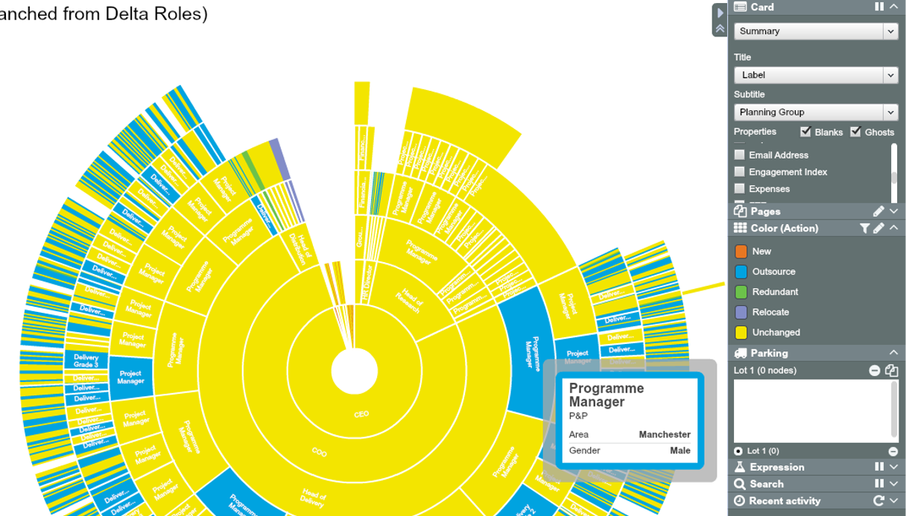
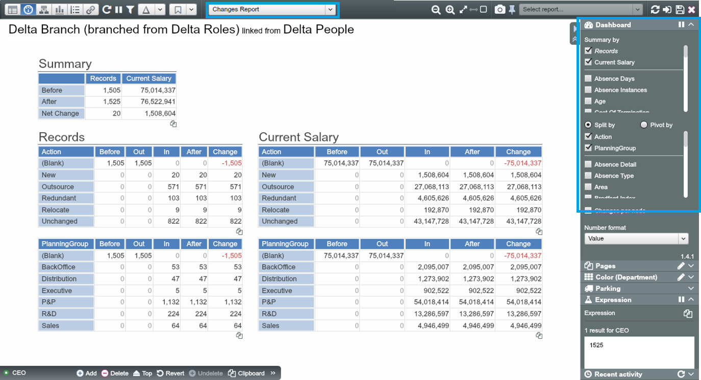
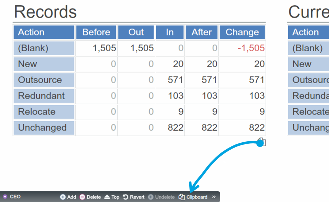
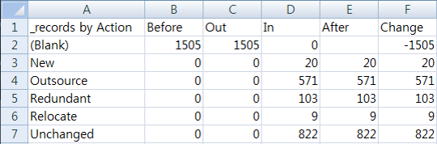

# Branching Exercise: Re-organisation by planning group

###Situation
* An organisation with 1,505 employees in 13 departments across 13 locations
* Planning to classify departments into planning groups and take necessary actions for operational efficiency

###Complication
* The impact of changes need to be measured quickly from multiple angles

###Tasks
* Model the To-Be organisation and capture impact of changes using Branching method
* Assign each of the departments to one of 6 planning groups and determine suitable actions for each area of business
  * Planning Groups: Back Office, Distribution, P&P, R&D, Sales and Executive
  * Actions: outsourced, redundant, relocate, reassigned, new, unchanged 

**Note:** Datasets to use: 1505 Dataset (clean)

## How-to summary

###Set-up a Branch

1. Create a **branch** of trunk (baseline) dataset(Save as -> check ‘create branch’)
2. The branched dataset will appear in Roles tab: Branches 
3. In the branched dataset, create required new properties, e.g. planning group, action

###Model the Scenario

1. Open up the branch and go to **Pivot view**
2. Assign each department to a planning group using **‘Paint with Data’**
3. Review each planning group and determine suitable actions – **‘Paint with Data’**

###Visualise the Impact

1. View the areas affected by changes using various visualisations in **Tree view**
2. Use **Changes Report  Dashboard** to see the differences against the baseline (original scenario)

##Get exercise data into OrgVue 

1. Open the Excel workbook for OrgVue Advanced Training
2. Find a data sheet for this chapter:
     1505 (clean)
3. In OrgVue, create a dataset named ‘Delta Roles – [your name]’ in the Roles tab using the ‘1505 (clean)’ data sheet; this will be your baseline dataset

##Set up a branch 

###Create a branched dataset

1. Open a baseline dataset and click on the ‘Save-As’ to create a branched dataset from it; this will prompt ‘Save as…’ dialogue
2. Give a name to the branch as ‘Delta Branch – [your name]’ and make sure to check ‘Create branch’ option

3. The branched dataset is stored in the ‘Branches’ section along with other branches

##Model the scenario

###Assign departments to planning groups

Go to Pivot view and re-group departments into planning groups using drag-and-drop:

1. Within the branched dataset create a new property ‘Planning Group’
2. Configure Pivot table – Department by Planning Group
3. Drag all nodes from Admin and drop onto the property name ‘Planning Group’ to set new value
4. In the ‘Set property value’ dialogue, type in the planning group name ‘Back Office’ 
 
5. Using the same method, assign the remaining departments into 6 planning groups - Back Office, Distribution, P&P, R&D, Sales and Executive

###Determine actions

Now planning groups have been set up for review and determine appropriate actions.

For each planning group, identify different actions for members of that group e.g. unchanged, new roles, redundancy, relocation, reassigned, outsource.  

These actions can be assigned by dragging roles to an existing action category or by creating new categories by dragging them onto the action title. Apart from Pivot, the functionalities such as Paging, Colouring, Filter Control can be useful for doing this.

Some questions you might want to consider:

1. How would we expand sales department?
2. What improvements could be made to the back office?
3. Identify some positions of projects & programs to be outsourced or made redundant 
4. Assume that the R&D planning group is unchanged
5. How might we simplify the distribution planning group? Assign actions to make some redundancies and some relocated roles
6. In the executive planning group, create a new CTO role and reassign some of the COO staff to the CTO

1. Create a new property ‘Action’ and set ‘Initial Value as ‘Unchanged’

2. Configure Pivot table – Planning Group by Action

3. As we want to review and assign actions for one planning group at a time, filter it to ‘P&P’ using Filter Control

4. For this example, to make those under-performing with high absence instances redundant, change the column to Bradford Index and colour by Performance Ranking
  * **Note:** Bradford Index is a measure of absenteeism. It weights the number of absent instances higher than the total duration

5. Assign those with Bradford Index higher than 600 and Performance Ranking lower than 6 ‘Redundant’ by drag-drop 

6. After having completed P&P, move on to other planning group and assign actions based on review taking into account the key questions

7. Take out the applied filters and review the actions determined by planning group 

##Visualise the impact

###Org Chart

1. Navigate to Tree view and choose the ‘Sunburst’ layout
2. Select properties to be displayed in each Card
3. Colour by ‘Action’ 

###Changes Report

See net effects of changes from various dimensions using Changes Report :
1. Navigate to Dashboard view and choose ‘Changes Report’
2. Configure summary and breakdown of changes

You can copy data out from ‘Changes Report’ to a spreadsheet:

1. Drag the          icon below each table onto the ‘Clipboard’ icon on Property Pane. Then press Ctrl-C

2. Paste it into a spreadsheet

