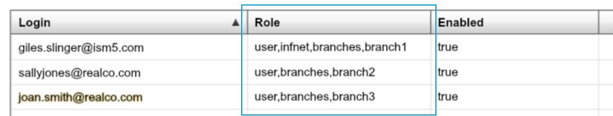
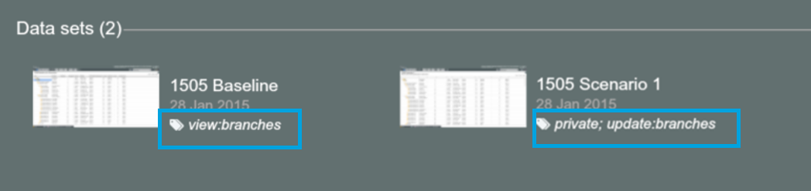
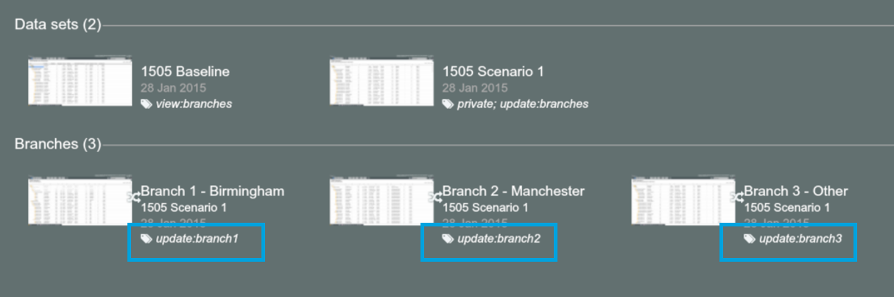
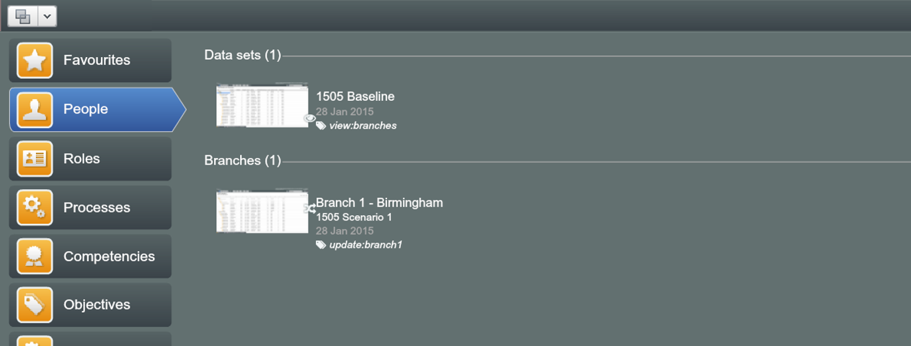
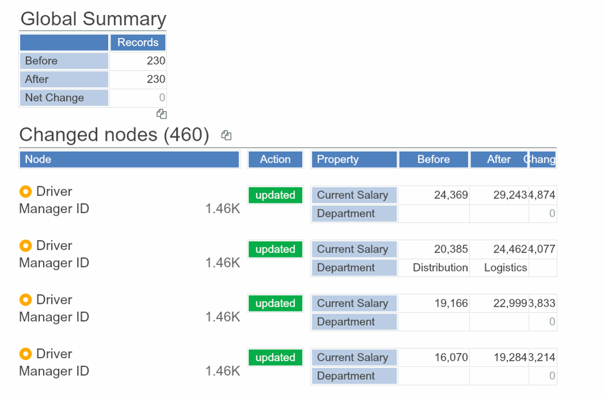
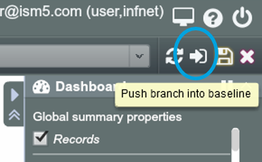
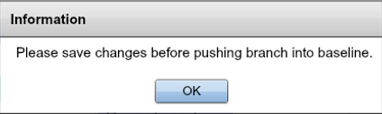
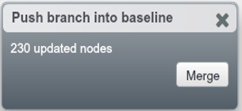

# Branching and Changes Report

##Method overview

A combined method of Branching and Delta is useful for collective scenario modelling.

Create a copy of baseline dataset and make it a Trunk of multiple branches to compile changes 

###Workflow

1. Prepare the Baseline dataset
2. Create the Scenario dataset – copy of the Baseline
3. Create branched datasets from the Scenario and set up user permissions for workstreams
4. Workstreams update their part (branch) of the scenario and review the changes made
5. If the changes look fine, push back the changes to the Trunk. The whole Scenario is updated with changes made in each branch
6. Capture net effect of changes by comparing Scenario against Baseline using Delta calculation

##Set up user permissions

1. From the Users dataset, set up users with the roles that we will use for their source dataset and branches

2. Go to the Home Screen. set up the baseline dataset and the Scenario dataset with tags to be viewed or updated by users who have ‘branches’ roles
  * **Note:** The*‘private’* and *‘update:branches’* tagging prevent direct access from branches as it is not visible to branches and allows changes to be flown back to the dataset through *‘push back changes’* function illustrated in the following slides.

3. Set up other branches, saving each one and tagging it for the relevant users to update

4. Note that the user sees only the Baseline and their branch because the Scenario dataset is marked *‘private’*

  **Branch 1 User View**

##Review changes

But the user with role ‘branch1’ can update Branch 1 and see changes vs. the whole Scenario 1 dataset.

##Compile changes

And in due course, the user with role ‘branch1’ can push their changes back to the Scenario 1 – its Trunk:

1. Click the ‘Push branch into baseline’ icon at top right 

2. If you did not Save the dataset before click the ‘Push branch into baseline’ icon, the warning pops up because only saved changes can be pushed back to the Trunk

3. The changes will flow back to Trunk once you click ‘Merge’

  
