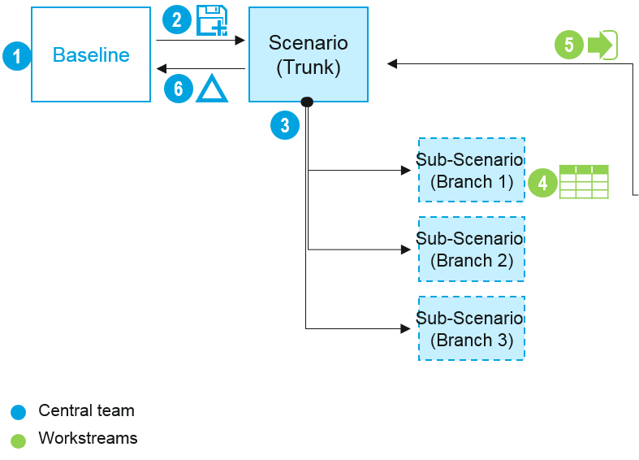

# Branching and Changes Report

##Method overview

A combined method of Branching and Delta is useful for collective scenario modelling.

Create a copy of baseline dataset and make it a Trunk of multiple branches to compile changes 

###Workflow

1. Prepare the Baseline dataset
2. Create the Scenario dataset – copy of the Baseline
3. Create branched datasets from the Scenario and set up user permissions for workstreams
4. Workstreams update their part (branch) of the scenario and review the changes made
5. If the changes look fine, push back the changes to the Trunk. The whole Scenario is updated with changes made in each branch
6. Capture net effect of changes by comparing Scenario against Baseline using Delta calculation

##Set up user permissions

1. From the Users dataset, set up users with the roles that we will use for their source dataset and branches

2. Go to the Home Screen. set up the baseline dataset and the Scenario dataset with tags to be viewed or updated by users who have ‘branches’ roles
  
