# Cloning Exercise: Re-organising sales department

##Using the Cloning method you can compare different scenarios side by side 

####Sophisticated overview of the scenarios in org hierarchy:

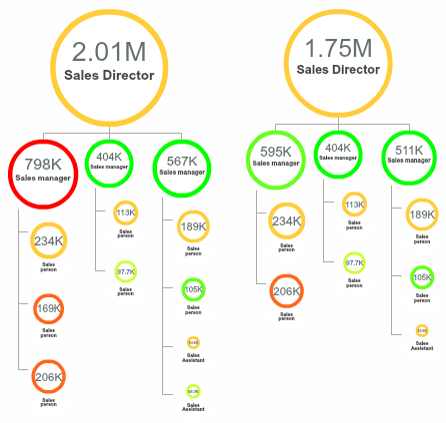

####Measure the impact from multiple angles:

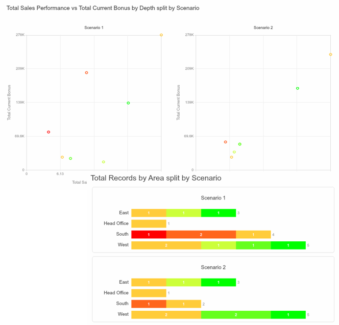

###Situation

* 
After a decline in sales, the board has appointed a new Sales Director

* 
The new Director has asked for a review of the 5 sales teams, each of which consists of 1 manager and 5-10 team members

###Complication

* 
Some incumbent sales managers are not performing in line with their grade

* 
The sales teams have become unbalanced in terms of cost, despite their sales geographies having similar potential

###Tasks

* 
Propose a simple re-organisation of the sales department, with two agreed design principles :

  * 
Top performing managers should be retained in team leader positions

  * 
Each team should have broadly similar overall cost

* 
The resulting To-Be organisation should then be compared with the As-Is, showing impact in cost and spans of control, overall and at each level

**Note:** Datasets to use: 9.1 Sales Department

##How-to summary

###Create a Clone

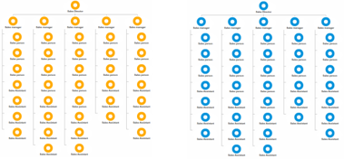

1. In Tree view, drag the root node onto             to clone the whole organisation

2. Create a property named Scenario

3. The original set of nodes inherit As-Is and the cloned set of nodes inherit To-Be

###Model the Scenario

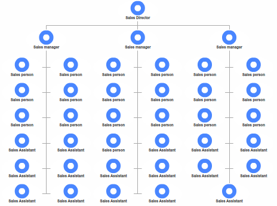

1. Filter out new scenario using Filter Control

2. Color by performance ranking

3. Assign top performance to team leaders

4. Scale the card based on roll-up cost 

5.Drag-and-drop the nodes to optimise number and size of teams

###Visualise the Impact

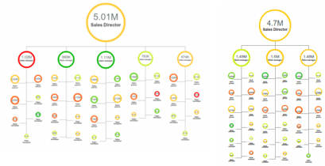

1. Compare organisational structure of the two in Tree view

2. Chart the differences, such as outgoing count split by depth, overall cost, average performance ranking etc.

###Get exercise data into OrgVue 

1. Open the Excel workbook for OrgVue Advaned Training

2. Find a data sheet for this chapter:
  * 9.1 Sales Department 

3. In OrgVue, create a dataset named ‘Sales Department – [your name]’ in the People tab using ‘9.1  Sales Department’ data sheet

##Create a Clone

###Copy the whole organisation

To clone the whole tree:

1. Drag and drop the root node onto               at the Property Pane

2. When ‘Confirm’ dialogue pops up, check ‘Clone’ to copy the whole organisation

3. Click ‘OK’

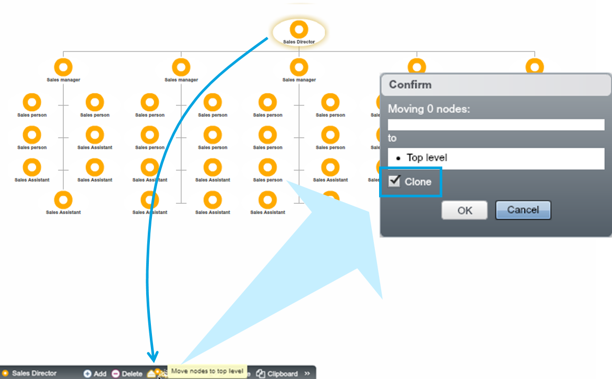

###Tag Scenarios

1. Add new property “Scenario” to tag two different scenarios
  * **Note:** Select ‘Inherit value’ to ensure that all nodes inherit the value from nodes above up to the top.
* Select the root node of one of the 2 org trees and type in ‘As-Is’ in the Scenario property via Property Pane
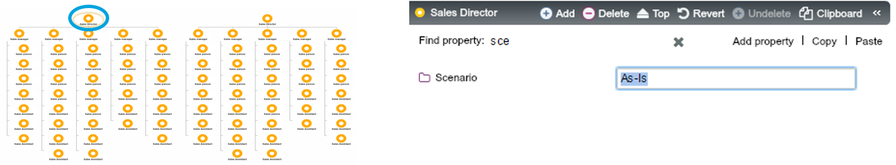
* Using the same method select the root node of the other tree and type in ‘To-Be’
* Hit ‘Refresh’  to inherit the new Scenario values down to all nodes
* Confirm there are two trees ready for scenario modelling - colour by Scenario to check that the clones are labelled properly

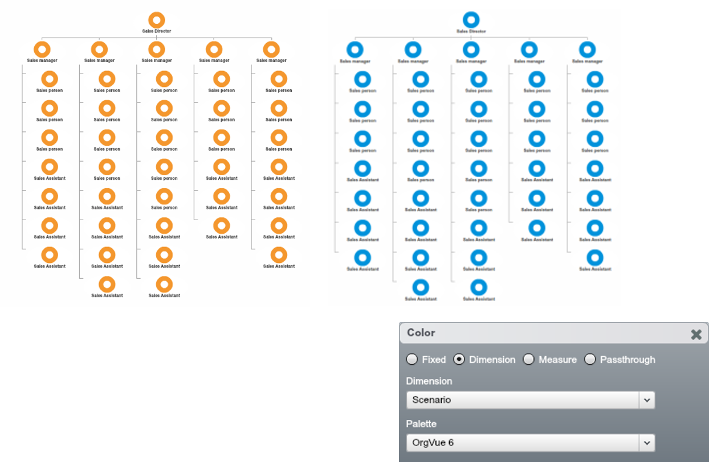

##Find gaps in the As-Is organisation and plan re-structuring

1. Using Filter Control, filter out the tree tagged as ‘To-Be’ scenario – still same as the As-Is scenario

2. Investigating sales performance and people skills across the department find gaps and think about what actions need to be taken

####Org Chart Coloured by “Sales Performance”

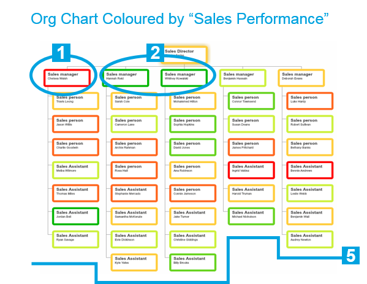

####Org Chart Coloured by “People Skills”

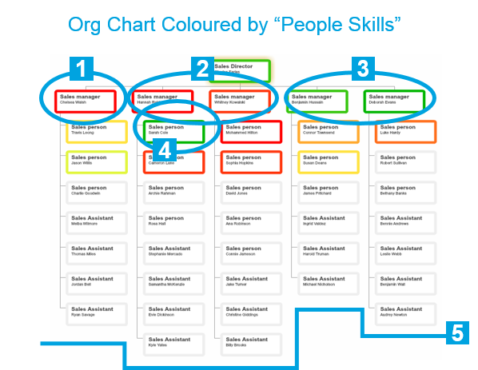

####Findings and Suggesions:

1. **Poor** at both sales performance and people skills - **leave position**
2. **Excellent** at sales performance but **poor** at people skills - **re-assign position to sales specialist**
3. **OK** sales performance but **excellent** at people skills - **retain manager position**
4. **Good** people skills - **ready to be a manager** 
5. Size of each team needs optimisation

##Model the Scenario

Based on analysis, make changes to the ‘To-Be’ organisation chart. For example:

1. Move two managers to the sales person position and delete another manager completely
2. Newly assign one sales person to manager position
3. Delete two team members with worst sales performance
4. Scale the card based on roll-up ‘Total Payroll Cost’
5. Re-structure the department into 3 teams considering cost, team size and individual performance

####Scaled Org Chart Colored by ‘People Skills’

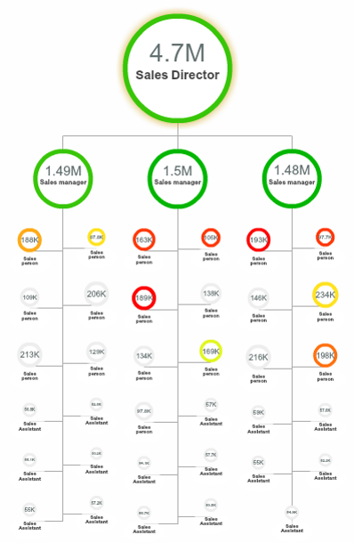

**Note:** the cost and size are now even across the teams.

##Visualise the impact:

###As-Is vs. To-Be in Hierarchical Structure

The org charts scaled by Payroll Cost (rolled up) show the impact of reduction in number of employees.

####As-Is Scenario

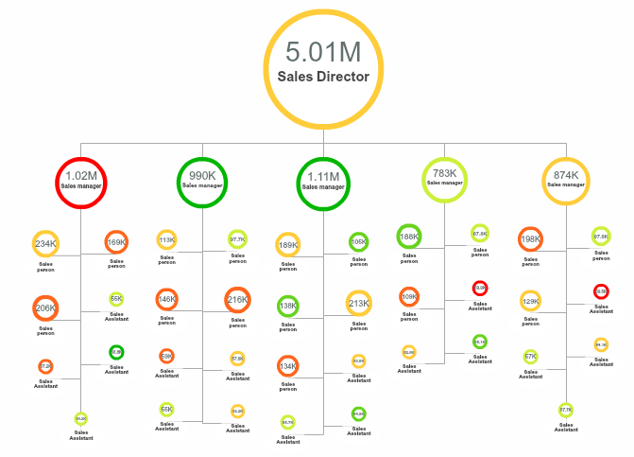

####To-Be Scenario

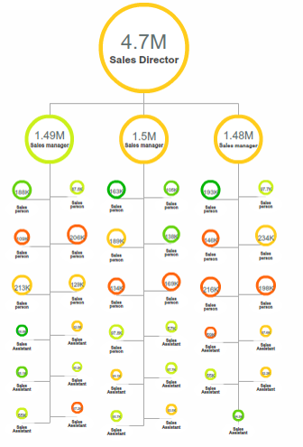

###As-Is vs. To-Be in Tree-Maps

To create the tree-maps below:

1. Navigate to Pivot view
2. Choose ‘Role’ as Columns and ‘Scenario’ as Rows
3. Choose the ‘Rectangles (scaled)’ Shapes
4. Set the Max/ cell for both Cards and Shapes as ‘0’ using slide
5. Colour by ‘Performance Ranking’

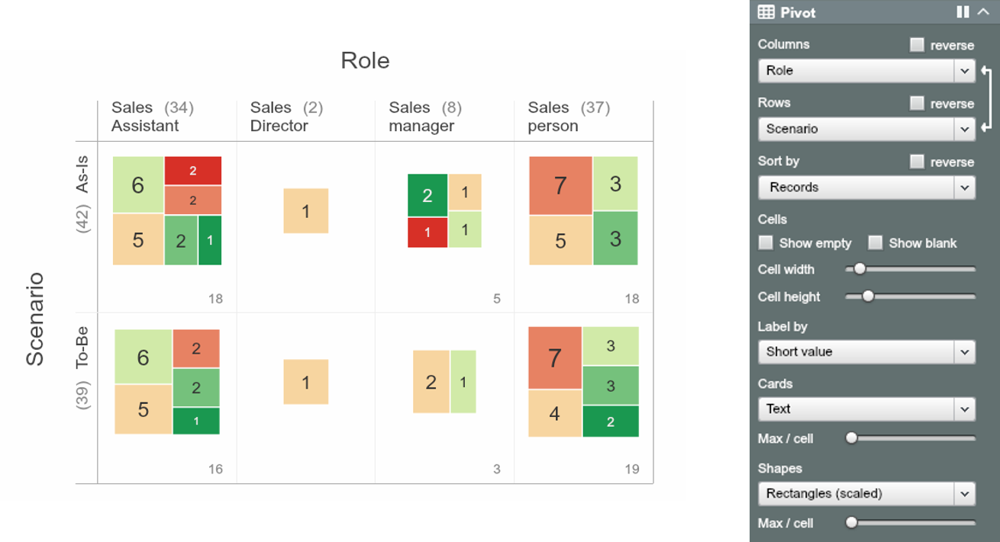

###As-Is vs. To-Be in using charts

Quantify the difference between the As-Is and the To-Be using charts, for example:

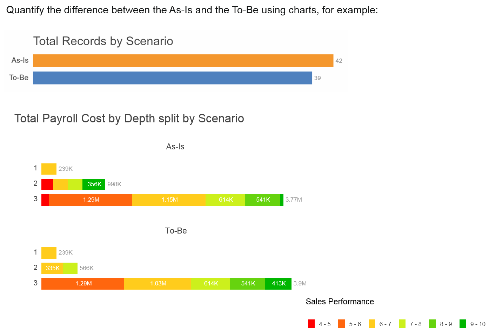

