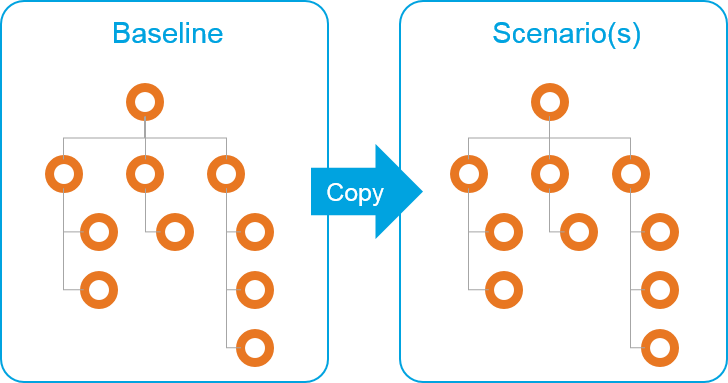
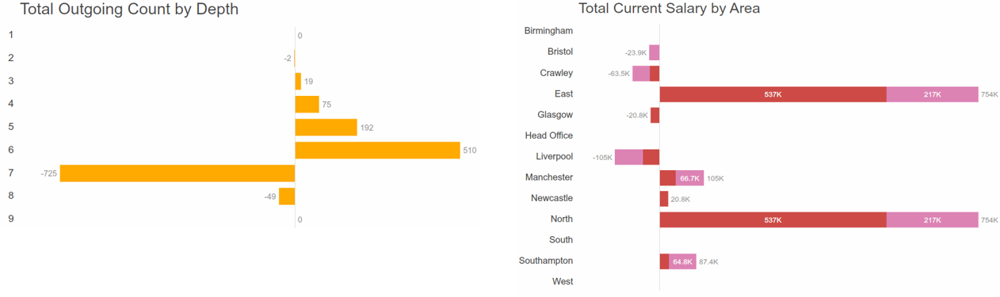

# Delta calculation

Unlike cloning and branching, in this method a scenario (or multiple scenarios) is created and managed in a separate dataset.

**Copy** the baseline and create a new dataset for scenario(s)

Delta captures net differences between two different datasets; the Scenario and Baseline.

To create a chart based on delta calculation:

1.Within the scenario dataset, choose the baseline dataset from the Delta drop-down list

2.Navigate to Chart view and create charts showing net differences between the two datasets. For example:

