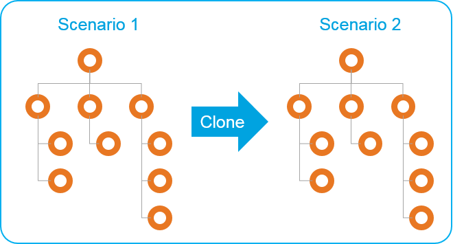
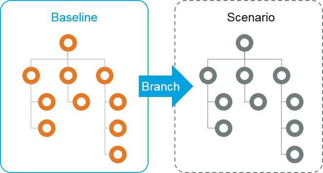

# Scenario modelling

##Cloning and Branching make scenario modelling intuitive and visual

###Method 1: Cloning

Create a clone of the original org **within** one dataset

* Useful for position level workforce planning 
* You can create more than 2 clones to compare multiple scenarios side by side
* Disadvantage: can clutter the dataset with multiple copies of nodes 

###Method 2: Branching

Create a branched dataset **from** the baseline dataset

* Useful when the baseline keeps moving, e.g. leavers, starters, role changes and etc.
* You can model scenarios with live data reflecting reality
* Calculate difference between branch (scenario) and baseline with high granularity using changes dashboard

