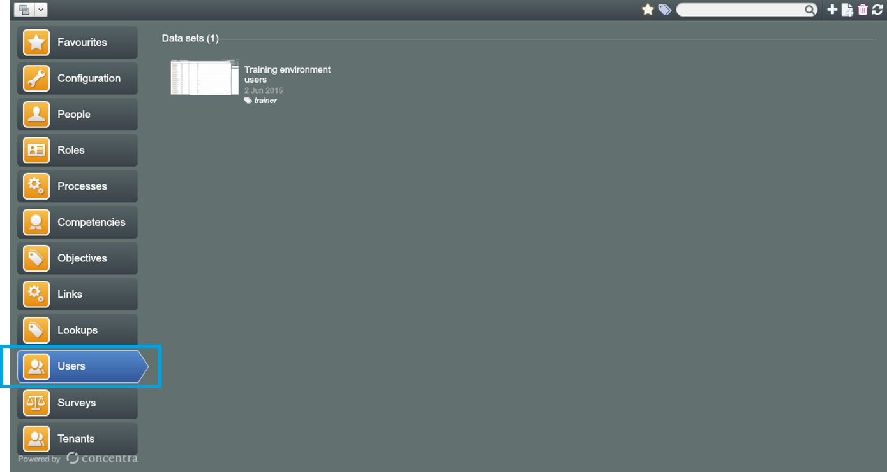
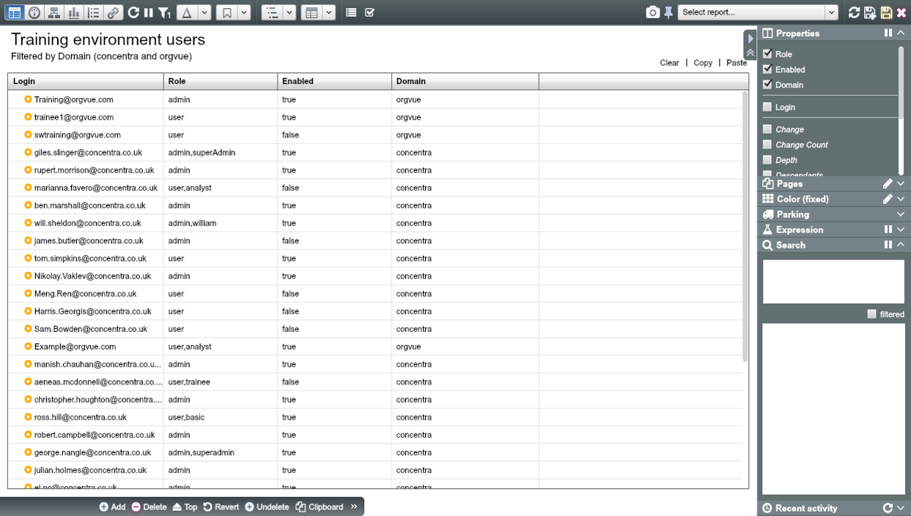
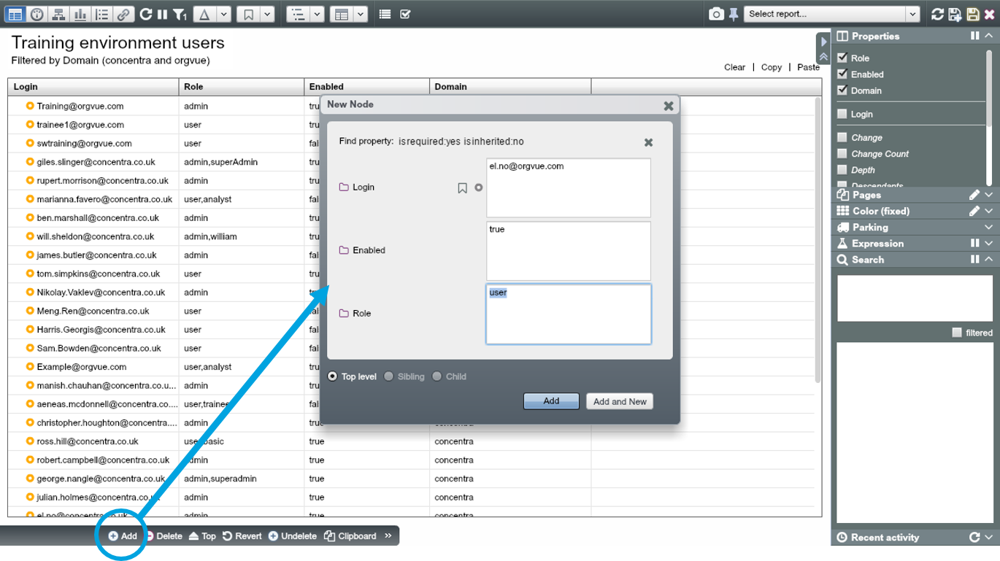
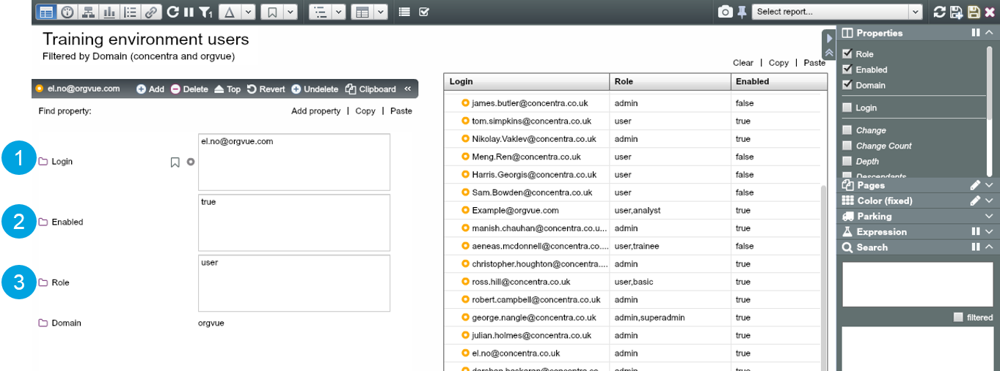
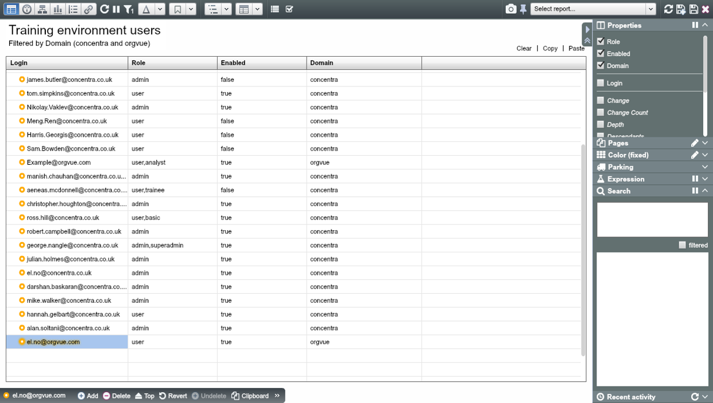
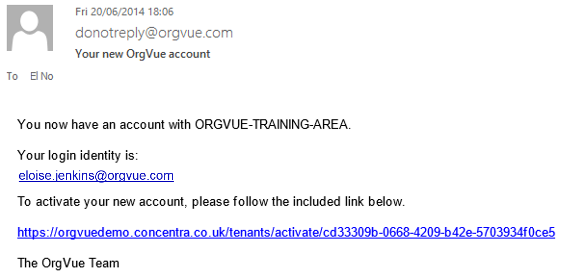

# Account administration

##Navigate to Users Tab

Admin can administer all user accounts through the Users Tab on the Home Screen.

**Note:** There should only be one dataset storing a list of accounts and roles within the Users dataset. Please do not 'Save as' a second dataset - this creates duplicate users.

##Open the Users Dataset
In the users dataset you can see a list of all of the accounts that have access to this Tenant

##Add a new account

Add a New Account through the ‘Add Node’ option on the Property Pane.

##Edit properties of the account node

Edit the Properties of the Account Node in the same way you would for any other nodes. There are only three editable properties for an account node:

1.
Login: in principle, email address can be edited, but If there is a mistake in an email address, you cannot amend it using this property – you will need to delete the node or change the ‘Enabled’ value to “false” and re-add the correct login

2.
Enabled: you can select between ‘true’ and ‘false’. To de-activate an account set the Enabled Property to ‘false’ as opposed to deleting the Node itself

3.
Role: most accounts should be set up as a ‘User’ Role, which limits the datasets they can view and edit in the tenant. You can then assign single or multiple permission groups to an individual user.

##Send out OrgVue login details to the new user(s)

Once you’ve configured the new accounts, save the dataset to send out OrgVue login details to the new Users. Only the users with ‘Enabled: true’ which have been newly-added to the list will receive an email from ‘donotreply@orgvue.com’ with login and password instructions.

##Example email sent to new users

Each new User will receive the following email from ‘donotreply@orgvue.com’, giving them login details.

##Things to bear in mind in tagging and permissions 

* No matter what other roles (permission groups), all accounts must have at least ‘user’ overlaid with other settings, e.g. user, finance – otherwise they will not be able to access Workspace

* If there is a mistake in an email address, you cannot amend it in the Users dataset – you will need to delete the node or change the ‘Enabled’ value to “False” and re-add the correct login

* If there are two instances of the same login in the Users dataset, the most recently added node will determine the level of security. If a node is accidentally duplicated with a different level of security, the best course of action is to delete both and re-add the node

* Where lookup datasets are used for providing custom colours, Users need to be able to view lookup datasets in order for proper functioning of colours 

*  Each dataset should have only one tag of each access type, multiple tags will not operate correctly when applied to one dataset
  *  e.g. view: hrbp,admin,exec, edit: hrcentral,finance (**V**)
  *  e.g. view: hrbp, view:admin, view:exec (**X**)

