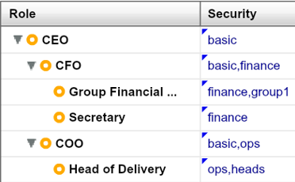
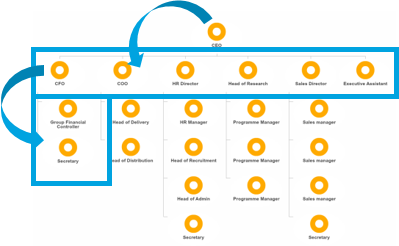

# Attribute Based Access Control method

##Overview

ABAC is used to restrict users’ access based on more complex rules; this allows access control at node level. Unlike RBAC, ABAC needs to be implemented by an OrgVue developer and only available for clients with an Enterprise license (highest of 3 levels).

There are 2 broad categories of ABAC:

1. **Label-based** (recommended)

  Users can only see nodes that have been ‘labelled’ as applicable for them.

  i. e.g. employees can only see people in their region
  
  ii. e.g. only HR can see employees with a salary of >£50k

  

2. **Hierarchy-based**

  Users can see nodes based on their reporting relationship.

  i. e.g. employees can only see themselves and their reports

  ii. e.g users can only see nodes at depth > 3

**Note:** Label-based is more efficient and robust to data quality than hierarchy-based.

#Rules

* ABAC rules are written in XML which allows very flexible rules to be written

* Configuration files containing these rules can either be saved on a dataset-by-dataset basis, or applied via the server to a whole tenant
* If a rule is hierarchy-based, the developer will use ancestor/ descendant style notation similar to what you learnt in training on Gizmo expression language
* If a rule is label-based, the developer will either reference properties in the dataset itself, or create a dedicated Security property in the Users dataset to store each user’s label (similar to ‘Role’ except only one label per user is normally allowed)
* In this case, the developer will create a corresponding Security property in the dataset(s) in which you are applying ABAC, and for each node, type the label(s) in a comma-separated list corresponding to the users that you want to be able to see each node

