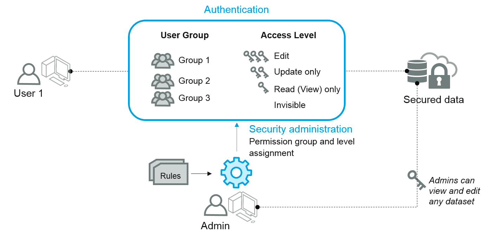
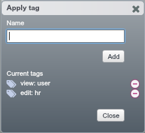
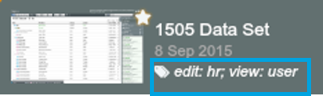
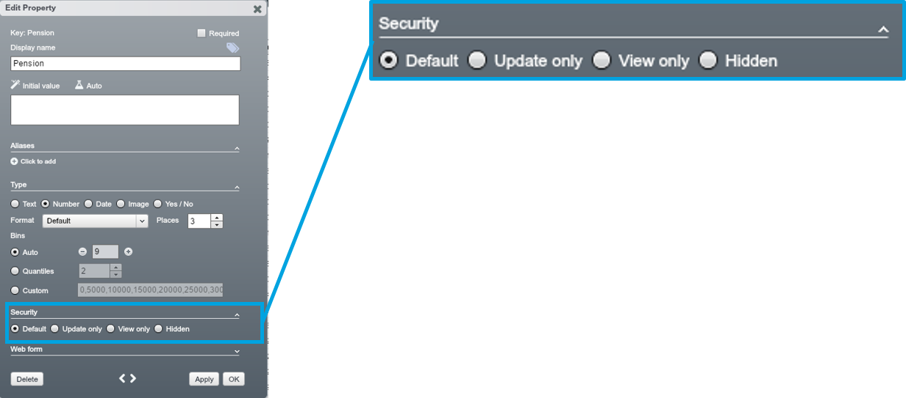
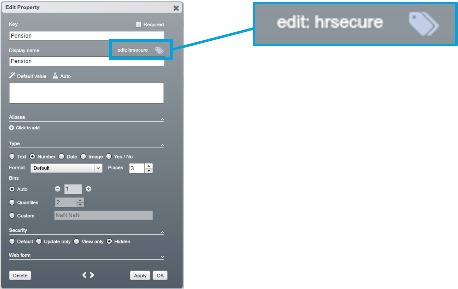
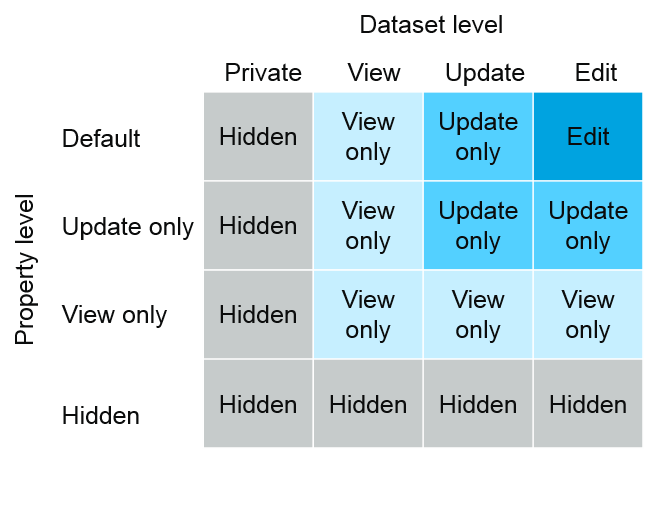
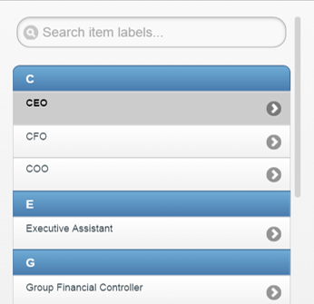
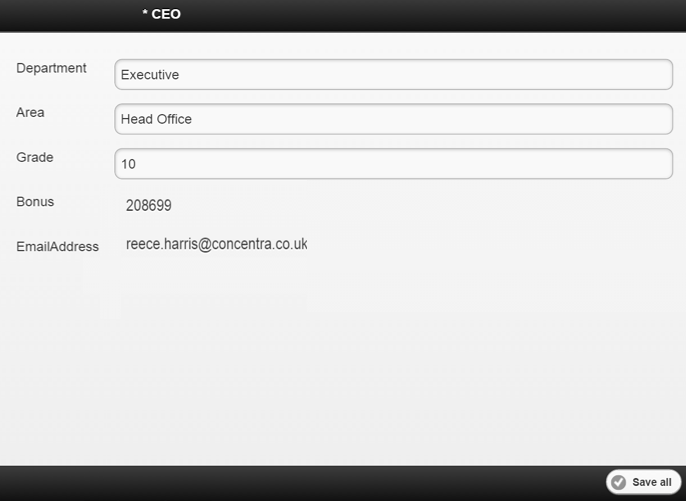

# Role Based Access Control method

##Overview

Users need to be given permissions to access datasets which they do not own. Using RBAC method, tenant Admins can administer user access to a dataset or a property; setting up user permission groups and tagging datasets/ properties.

## At dataset level

Using RBAC method, the dataset owner or Admin can set the level of Users' access to a dataset. The following steps will control user access at dataset level:

1. Define custom permission groups and assignment rules, e.g HRBP, Finance, IT, Manager
2. Assign an individual user to a permission group(s)
  3.  Open the Users data tab in the Users tab
  4.  Select the user whose access level you wish to alter and modify a User's role to put it into extra permission groups

3. Set a permission group's access level to a dataset using Tags
    * Select a dataset from the Home Screen and click on ‘Tags..’ icon at the top-right
Only listed roles (and admins) can see the dataset, though others may be able to edit it (useful for webforms and branches)
    * Using ‘Apply tag’ dialogue, set appropriate access levels for a permission group
    * Tags are displayed along with dataset name and date modified

| Access |Tag example |
| -- | -- |
| Invisible | (no tag) |
| Read only | view:user |
| Update only | update:it,ops |
| Edit | edit:hr |

**Note: You can Tag a dataset to be Viewed or Edited by multiple permission groups**

##At Property Level

RBAC can be implemented at property level within a dataset. To limit a user’s access to dataset properties based on role, use the property ‘Security’ options in the Edit Property dialogue.

| Access | Description |
| -- | -- |
| Default | Dataset/ property can be accessed and edited by anyone tagged as “edit:….”|
| Update only| Cell values can be updated but the structure (e.g. node hierarchy, property settings) cannot|
| View only| Can be seen but not altered in any way|
| Hidden | Cannot be seen by anyone other than admins and the dataset owner|

**Note: setting a property to ‘Hidden’ will mean that standard users cannot colour by it or use it in any expressions.
**

Tagging the property in a similar way to datasets allows access to specific users. In this example, the default security is set to Hidden – normal users will not see this property (including when it is used in expressions). However, users tagged as ‘hrsecure’ will be able to view and edit this property.

| Access | Tag example |
| -- | -- |
| Invisible | (no tag) |
| Read only | view: hrgeneral|
| Update only| update: hranalyst|
| Edit | edit:hrsecure|

**Note: tagging properties uses the same formats as datasets.
**

##Key rules to permissions

There are key rules to help you understand how RBAC works between datasets and properties.

**Key rules to permissions**

OrgVue is cautious by default.

1. **‘Hidden’/ ‘Private’** overrules other permissions, i.e., a private dataset is always hidden - a hidden property in a editable dataset is still hidden
2. For non-hidden properties, setting a dataset to **‘View’** overrides any property-level security
3. For non-private datasets, setting a property to **‘View only'** or **‘Update only'** will restrict access

**Interaction between dataset and property level

##Tags

Tags are used for access control and also interacting with datasets. The following lists some basic ones. 

| Tag | Description|Scope|Difficulty|Description |
| -- | -- | -- | -- | -- |
| view:<user_role(s)>| view:ops|Dataset | Standard | Listed roles can view the dataset only|
| update:<user_role(s)>| update:hr,finance| Dataset |Standard | Listed roles can update cell values but not properties|
| edit:<user_role(s)>| edit:seniorhr| Dataset| Standard | Listed roles can edit cells and Properties|
| fav | | Dataset | Standard | Put the dataset in the Favourites tab for all users|
| lookup |  | Dataset | Standard | Flag a dataset outside the Lookups tab as a lookup |
| template |  | Dataset | Standard | Allow a dataset to be copied from the home screen|
| survey |  | Dataset | Advanced | Automatically applied by OrgVue to surveys|

There also a range of tags to further customise the behaviour of datasets and properties.

  | Tag | Example | Scope | Difficulty | Description |
| -- | -- | -- | -- | -- |
| owner:<user_role(s)>|owner:hr,finance,ops|Dataset | Advanced | Listed roles can only view and edit nodes that are labelled with their role in a ‘Owner’ property 
| private:<user_role(s)>| private:hr| Dataset | Advanced | Only listed roles (and admins) can see the dataset, though others may be able to edit it (useful for webforms and branches)|
| archived |  | Dataset | Expert | Hides a dataset from all users, inc. admin, without deleting it – searching tag:archived will display it again |
| tasks | | Dataset | Expert | Allows people with the role 'tasks', who cannot log in to workspace, to submit data via OrgVue taskforms
 |
| workflows:<task_name>| workflows:my objectives | Dataset | Expert | Creates a blank task for the tenant with name <task_name> and stores a task script |
| scripts:<scripts>|scripts:2.19,2.20| Dataset | Expert | Determines the OrgVue release versions in which a configuration dataset can be used |
| csv |  | Property | Advanced | Suppresses OrgVue number formatting to allow cells to contain ###,###,##|
| parent:<secondary_id> | parent:matrixid| Property | Advanced | Sets up a secondary hierarchy where the tagged property is the parent ID and <secondary_id> is the ID|

##Example: permissions for Webforms

To view all the entries in a webform, you have to be:

* An admin, **OR**
* The owner of the dataset
* 

**N.B. Entries are limited by the filter applied to the dataset at the time its link is created**

If you are not, you can only see entries if the dataset is tagged view/update/edit:<your_user_role> AND **EITHER**
* You are a designated owner* of that node (using the email format described below); **OR**	
* An objective has no designated owner (or owner is not in email format)

To designate owners, create a property called “owner” and add the email address that the person uses to log in to OrgVue. Allow multiple people to view the same nodes by entering the email addresses in a comma-separated list (no spaces).

To view properties within a webform, 2 things have to be true:

* The properties are enabled “include on webform”, **AND**
* They are currently visible in the property window

To edit data in a field, you must be

* An admin, **OR**

* The owner of the dataset, **OR**

* The dataset must be tagged update / edit:<user_role> **AND**

* The property you are trying to edit is not set as ‘hidden’ or ‘read only’ in the dataset

