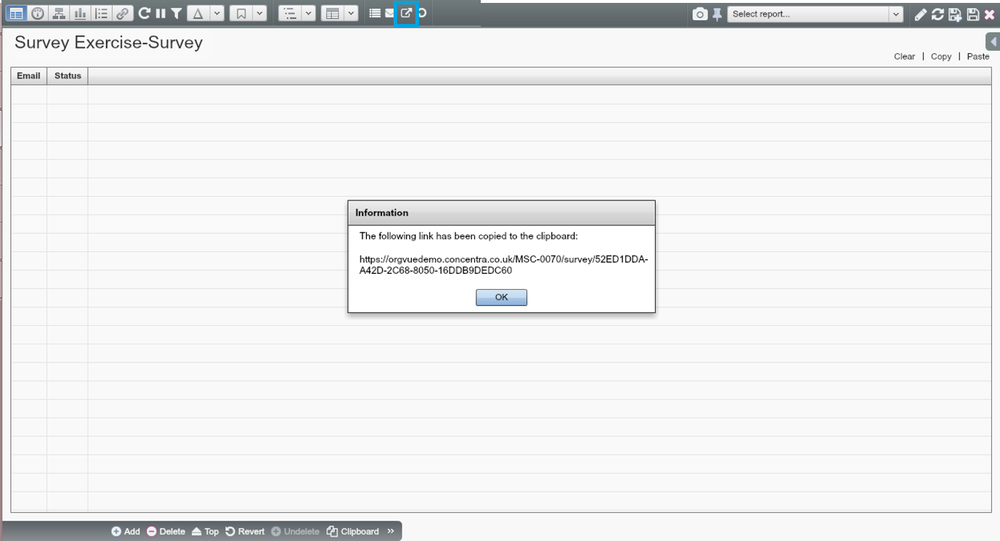

# Exercise: Survey on cycling

##Situation

As a benefits manager, you are evaluating some new staff incentive options to potentially introduce to the company.

##Complication

A ‘Cycle to work scheme’ has been suggested, and you want to investigate the potential interest from employees.

##Tasks

Using Surveys, design and complete a quick survey on cycling,
* Choose an appropriate question type for each question in the survey
* Set up the survey as an open survey
* View the results after completing the survey.

##How-to summary

###Set up a target database

1. Open a new dataset and create properties according to questions 
2. Choose a proper question type for each question and set other values accordingly

###Set up a survey

1. Set up parameters for the survey 
2. Create a survey link and complete it 

###Review the results

1. Go back to the target dataset and check the data populated through Survey

##Set up the target dataset

###Property setting

Create a new Dataset in the People tab, and add 6 new Properties for the following 6 Survey questions on cycling.

1. Name
2. Department (Finance, HR, Marketing, Sales, IT)
3. Your favourite transport mode (Motorbike, Bicycle, Car, Underground)
4. Do you cycle on a weekly basis?
5. On average, how often do you use your bicycle per week?
6. On average, how many KM do you cycle each week?

In the ‘Add Property’ dialogue box, set up parameters for the Property and the question displayed in the Survey.

###Duplicate the property

For questions of a similar nature, simply configure the first question and then clone it to quickly apply it across to the other questions. 

To create a property by duplicating another property:

1. Click ‘Clipboard’ icon to duplicate this property; this will prompt the Add Property dialogue box 
2. Amend the details of the cloned property where necessary

##Set up the survey

###Create a survey database

To create a Survey, click on the ‘Create Survey’ icon      on the toolbar across the top. You will be taken to a Survey Dataset and asked to configure Survey Parameters.

**Note:** Webform and Survey icons are only available in Worksheet view.

###Configure parameters

Configure the parameters of the Survey in the Survey Properties dialogue box. After clicking ‘Ok’ you’ll see that you’ve now set up a ‘Survey’ dataset (which currently has no nodes).

###Save and create survey link

After saving the Survey dataset, click on the ‘Create Link’ icon        to copy the Survey Link.

###Save and email survey link

Alternatively, you can email this link to the Survey respondents.
1. Add respondent emails to the Survey dataset then Save
2. Click the ‘Email’ icon to email the survey to the entire respondent list

###Access survey and complete

Open a web browser and paste the link to access and complete the Survey.

##Go back to the target dataset and review the results

The Survey Owner can then go back to the People tab and open the target Dataset.

The Survey results that have been submitted are saved and displayed in this Dataset.

##See the data through the Webform

Additionally, you have the option to see the data displayed as part of the Webform interface.

You can view and edit your property values through the Webform.

