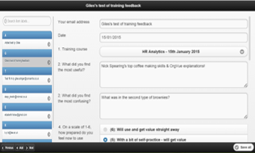
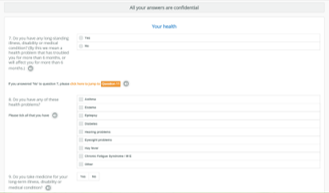
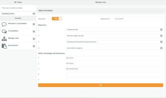

# OrgVue interfaces overview

OrgVue has 3 additional interfaces to gather, update and manage your data. 

| | Webforms | Surveys | Tasks |
| -- | -- | -- | -- |
|  | |  |  |
| What? | Online forms that allows users to update a dataset. Require users to have an OrgVue login| Customisable surveys that can be administered via OrgVue. Can be sent to anyone - response progress is tracked | A single URL containing several bespoke apps Requires users to have access to OrgVue|
| Why use? | Useful when you want multiple users to **update** various aspects of a dataset without logging in to Workspace| Useful when you want to gather **one-off** information from a large number of respondents and aggregate the results| Useful when you want to guide users through a **data entry process**, especially if it involves dynamic workflow/ approval|

**Note**: This chapter focuses on Webforms and Surveys - Task is fully covered in the ‘Transition Management’ course.

