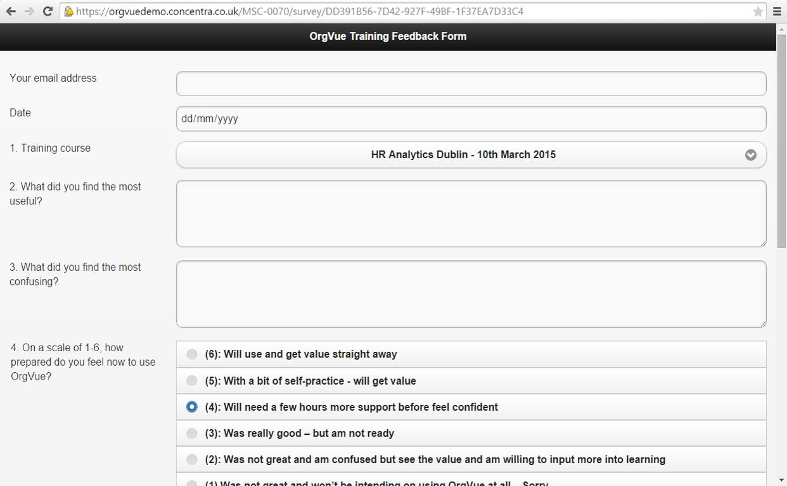
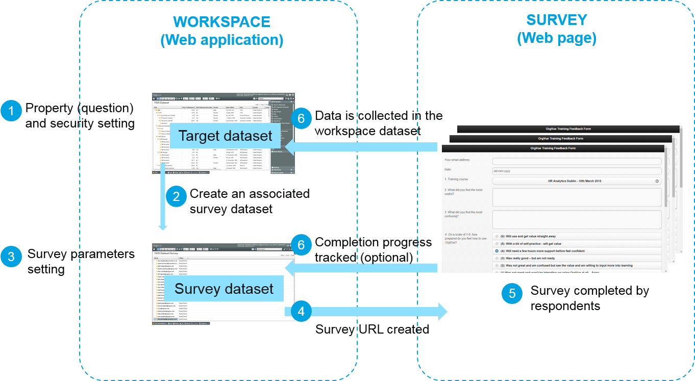
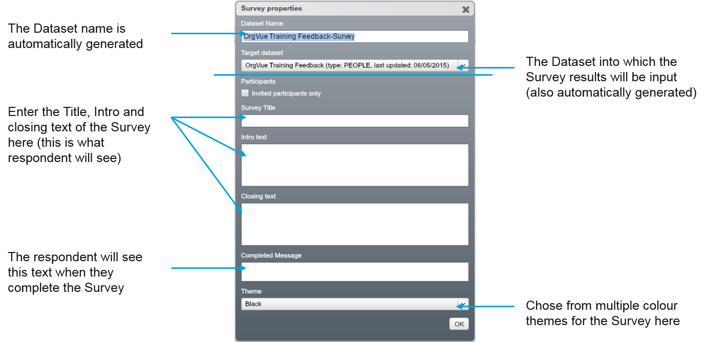
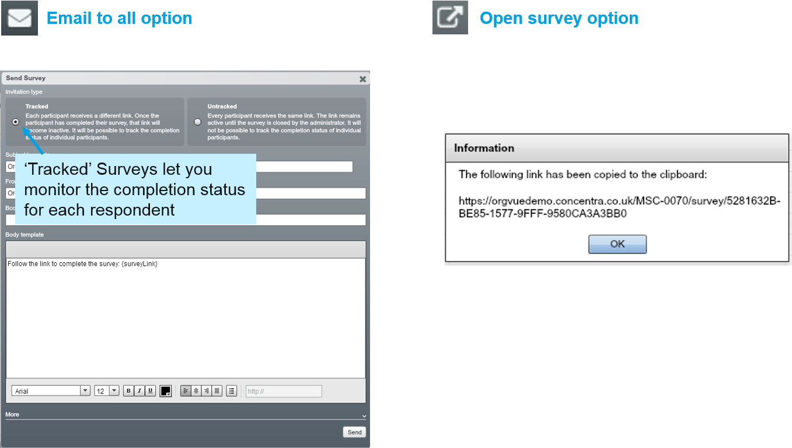
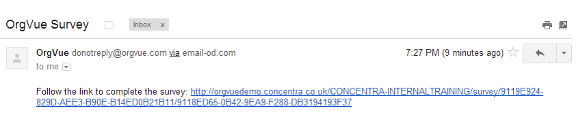
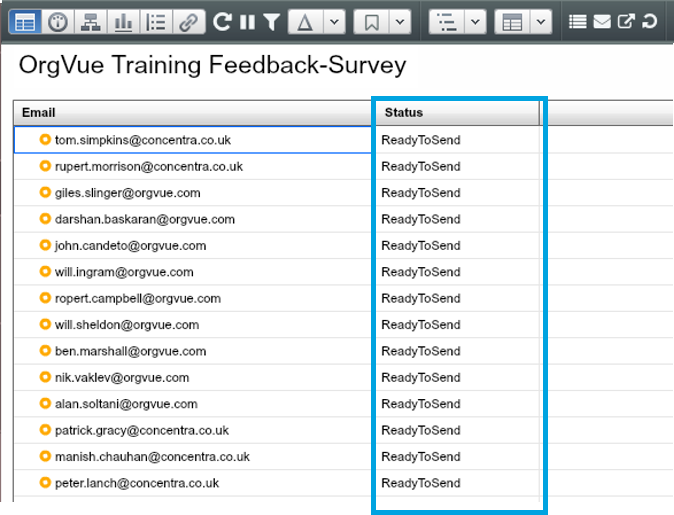

# Surveys

##Introduction

OrgVue Surveys are highly customisable and useful for gathering data from a large number of people.

##How Survey interfaces with Workspace

The Dataset is updated in real time when each respondent submits their Survey responses.
 

##Setting survey parameters

In OrgVue Workspace, when you click on           from the toolbar in Worksheet view, you will be taken to a Survey Dataset and asked to configure Survey Parameters.

##Survey type options

You can either email the Survey to everyone listed in the Survey Dataset or get a Survey Link and send it as an Open Survey.

**Note:** You cannot send a Survey Link if you checked the ‘Invited Participants Only’ box on the ‘Survey Properties’ dialogue.

##Email to all option

###Email sent to respondents

If you choose the Email to all option, all Survey respondents will receive the following email allowing them to access the Survey.

**Note:** Remember this Tracked Link is specifically unique to this Respondent.

###Tracked survey

When the ‘Tracked’ option is selected, you can manage the respondent list and monitor the completion status for each respondent from the Survey Dataset.

* Each Survey Respondent will represent one node (record) in the Target Dataset
* The Status changes from ‘ReadyToSend’ to ‘Sent’ when the survey invitation email is sent to the address
* After a respondent has submitted the Survey, the Status changes to ‘Submitted’
* Respondent can’t go back and edit previous responses

 

