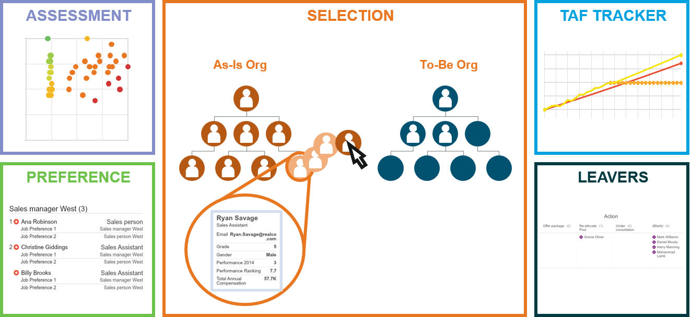

# Tasks

##Transition management overview

A Task is a custom web form built to support a particular workflow.

**Transition management modules – an overview **

**Note:** Tasks forms and Transition management is fully covered in the Transition Management chapter. 