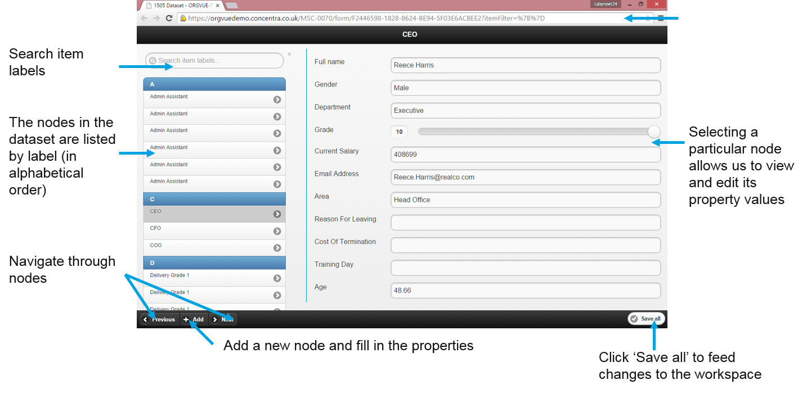
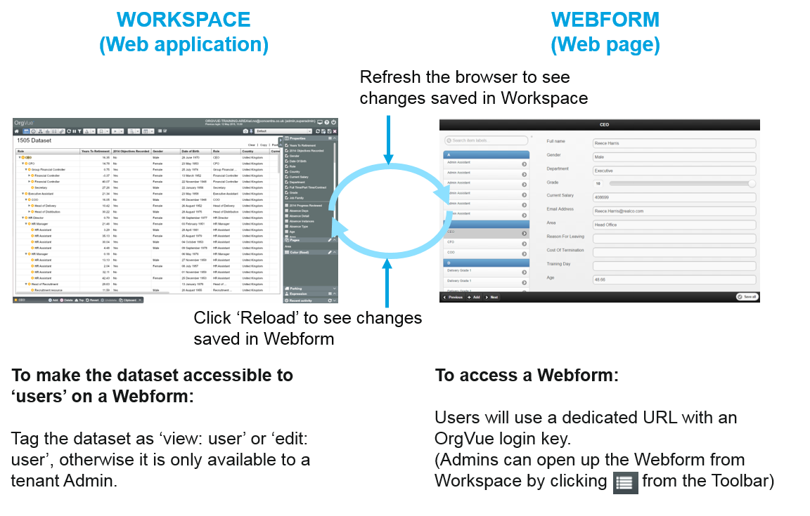
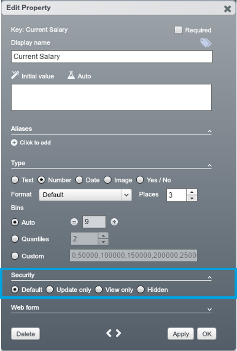
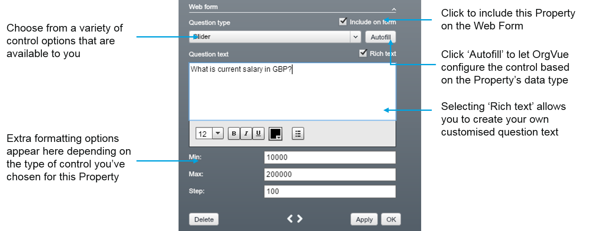
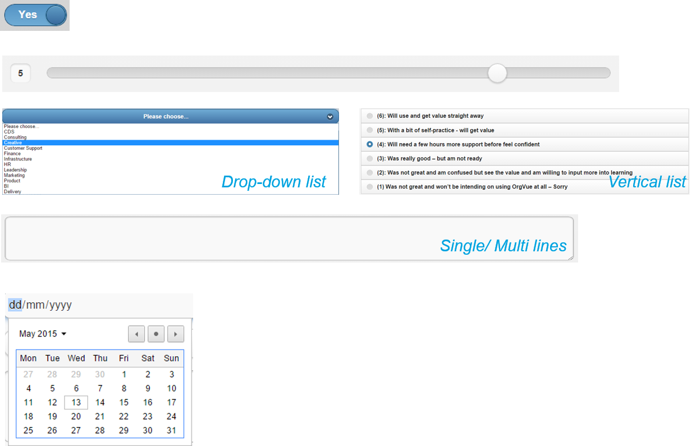

# Webforms

##Navigation

A Webform provides convenient interface to view and update data. 

**Example: 1505 Dataset accessed through Webform**

##How Webform interfaces with Workspace

Use a Webform to allow certain users to access all records in the Dataset – but with potentially limited permissions.

**Note:** Security settings can be configured at individual node and property level. See the "Property Security Settings" page and refer to the "Security and Administration" chapter

## Property security settings

Property Security settings which can be configured in the Edit Property dialogue determine whether other Users can view or edit the Property on any Webforms and Surveys.

###Security options for individual properties

* **Default:** Dataset/property can be accesses and edited by anyone tagged as “edit:….”
* **Update only:** Users can edit the value for this property vs. change the security details (or control types) for this property
* **View only:** Users cannot modify the values or security details however they can still view them
* **Hidden:** Users are not even aware that this Property exists

##Access control

In the Webform section in the Edit Property dialogue, you can choose the Question Type to determine the type of control used on Surveys and Webforms.

##Question types

A variety of question types are available to choose from when configuring Survey and Webform questions.

